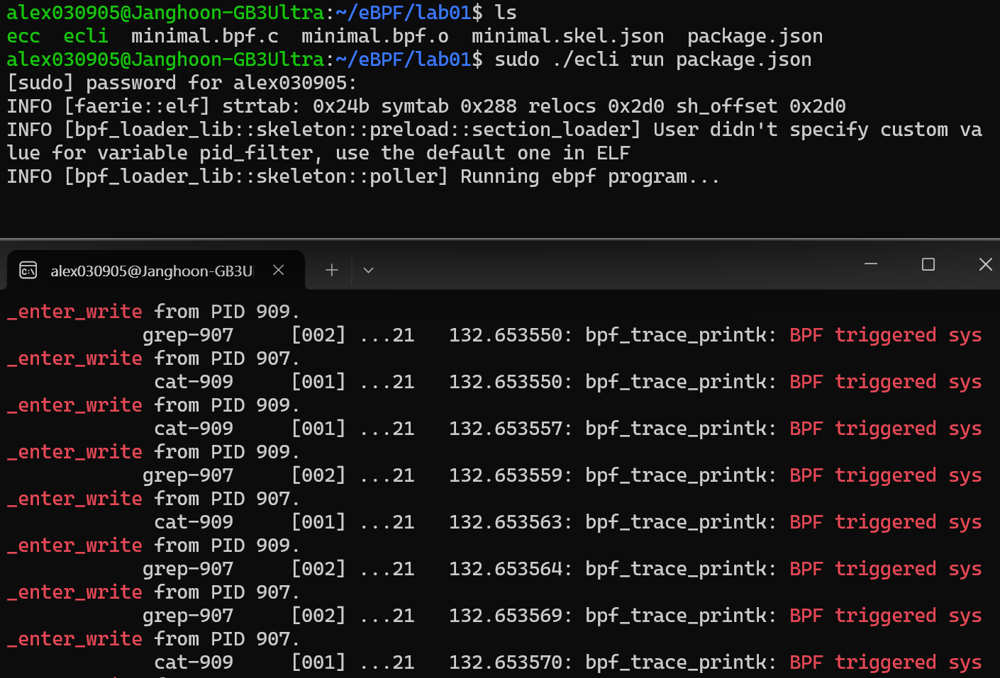
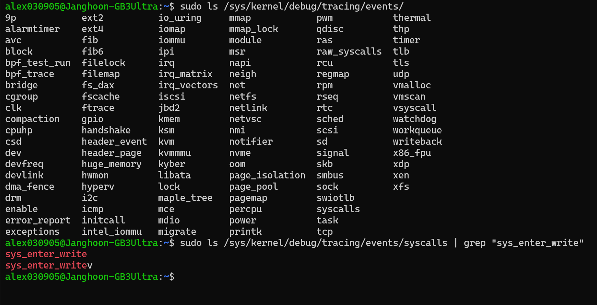

# Tracepoint 기반 syscall 후킹

### ecc 
- ecc(eBPF C Compiler)는 C 언어로 작성한 eBPF 프로그램을 커널이 이해할 수 있는 eBPF 바이트코드와 메타데이터(JSON) 로 변환해주는 도구이다.  

**역할**
- `.c` 파일로 작성된 eBPF 프로그램을 LLVM IR → eBPF 바이트코드 → JSON 형식으로 변환한다.
- 프로그램에서 사용되는 eBPF 맵을 JSON에 함께 포함한다. 
- 결과물이 ELF 오브젝트가 아닌 JSON 형식이므로, 다른 환경에서도 쉽게 실행 및 배포할 수 있다.

> LLVM IR(Low Level Virtual Machine Intermediate Representation)은 c/cpp 같은 하이 레벨과 로우 레벨 사이에 있는 중간 언어이다.  

<br>


### ecli (eBPF Command Line Interface)  
**ecli** 는 eBPF Command Line Interface 의 약자로, `ecc` 가 생성한 JSON 파일을 읽어 커널에 로드하고 제어하는 역할을 한다.  
사용자가 bpftool이나 직접 BPF syscall을 호출하지 않아도 직관적인 CLI를 통해 eBPF 프로그램을 다룰 수 있게 해준다.  
<br>

**역할**
- JSON 기반 eBPF 프로그램을 커널에 붙여준다.
- JSON에 정의된 맵을 생성, 조회, 수정할 수 있다.


<br>

### ecc 와 ecli 사용 순서

1. C 코드로 eBPF 프로그램 작성  
   → `prog.c`

2. ecc 로 컴파일  
   → `prog.json` 생성 (바이트코드 + 메타데이터 포함)

3. ecli 로 로드 및 실행  
   → 커널에 attach, 로그 확인, 맵 접근 가능

요약하자면, ecc 는 빌드 도구, ecli 는 실행, 관리 도구이다.

<br>

### ecc, ecli 설치
```bash
$ wget https://aka.pw/bpf-ecli -O ecli && chmod +x ./ecli
$ ./ecli -h
Usage: ecli [--help] [--version] [--json] [--no-cache] url-and-args
```

```bash
$ wget https://github.com/eunomia-bpf/eunomia-bpf/releases/latest/download/ecc && chmod +x ./ecc
$ ./ecc -h
eunomia-bpf compiler
Usage: ecc [OPTIONS] <SOURCE_PATH> [EXPORT_EVENT_HEADER]
....
```

ecc와 ecli 를 다운 받고 간단한 예제부터 시작해보자.  
<br>

### minimal.bpf.c 실습 파일
```c
/* SPDX-License-Identifier: (LGPL-2.1 OR BSD-2-Clause) */
#define BPF_NO_GLOBAL_DATA
#include <linux/bpf.h>
#include <bpf/bpf_helpers.h>
#include <bpf/bpf_tracing.h>

typedef unsigned int u32;
typedef int pid_t;
const pid_t pid_filter = 0;

char LICENSE[] SEC("license") = "Dual BSD/GPL";

SEC("tp/syscalls/sys_enter_write")
int handle_tp(void *ctx)
{
 pid_t pid = bpf_get_current_pid_tgid() >> 32;
 if (pid_filter && pid != pid_filter)
  return 0;
 bpf_printk("BPF triggered sys_enter_write from PID %d.\n", pid);
 return 0;
}
```
위 코드를 `minimal.bpf.c` 이름으로 저장해두고 실행해보자.  
어떤 코드인지는 실행 후 결과를 보고 분석해보기로 하고, 실행하기 위해 우선 clang과 llvm 먼저 다운로드 받자. 각 역할은 아래에 정리해뒀다.    
<br>

### clang, llvm 설치  
```bash
sudo apt install clang llvm
```
- clang: C 코드를 LLVM IR 로 변환하는 역할
- llvm: LLVM IR 을 eBPF 바이트코드 로 최종 변환하는 역할

<br>

### 실습 파일 컴파일
```bash
$ ./ecc minimal.bpf.c
Compiling bpf object...
Packing ebpf object and config into package.json...
```

ecc로 컴파일을 해준다.   
<br>

그리고 폴더에 존재하는 파일들을 보면 아래 처럼 나오고 각 역할은 다음과 같다.  
- `minimal.bpf.c` : eBPF 프로그램을 C 언어로 작성된 원본 c 코드  

- `minimal.bpf.o` : ecc로 컴파일한 eBPF 오브젝트 파일이다.  
  - 커널이 직접 이해할 수 있는 eBPF 바이트코드와, 맵 정의 등의 메타정보가 포함되어 있다.
- `minimal.skel.json` : ecc가 `.o` 파일을 기반으로 생성하는 스켈레톤 JSON 파일이다. 
    - 이 JSON 파일 덕분에 실행 환경(ecli) 은 `.o` 파일을 직접 파싱하지 않고, JSON을 읽어서 손쉽게 프로그램을 attach 할 수 있다.

- `package.json` : 해당 프로젝트의 빌드, 실행 환경 설정 파일  

이렇게 총 네개의 파일이 존재하게 되는데 이중에서 프로젝트 빌드에 해당하는 `package.json` 파일을 실행시켜주면 된다.   
<br>

### 프로젝트 실행

ecli로 실행시켜주고,  
```bash
$ sudo ./ecli run package.json
Running eBPF program...
```
<br>

아래 명령어를 쳐서 해당 문자열을 grep 해주면 된다.  
```bash
$ sudo cat /sys/kernel/debug/tracing/trace_pipe | grep "BPF triggered sys_enter_write"
```
<br>

  
  
이렇게 계속해서 `BPF triggered sys_enter_write` 문구가 계속 뜨는 것을 볼 수 있다.    

왜 이런 결과가 나오는지 확인해보자.   
<br>

### minimal.bpf.c 분석
```bash
/* SPDX-License-Identifier: (LGPL-2.1 OR BSD-2-Clause) */
#define BPF_NO_GLOBAL_DATA
#include <linux/bpf.h>
#include <bpf/bpf_helpers.h>
#include <bpf/bpf_tracing.h>

typedef unsigned int u32;
typedef int pid_t;
const pid_t pid_filter = 0;

char LICENSE[] SEC("license") = "Dual BSD/GPL";

SEC("tp/syscalls/sys_enter_write")
int handle_tp(void *ctx)
{
 pid_t pid = bpf_get_current_pid_tgid() >> 32;
 if (pid_filter && pid != pid_filter)
  return 0;
 bpf_printk("BPF triggered sys_enter_write from PID %d.\n", pid);
 return 0;
}
```
<br>

### SEC  

우선 쉬운 이해를 위해 요약 먼저 해보자면,    
`SEC("tp/syscalls/sys_enter_write")`   
`int func()`   
구조에서 tp(tracepoint)라는 방식으로 `sys_enter_write`에 `func`을 붙이겠다라는 뜻이다.  

SEC 안에 들어가는 문자열은 크게 두 부분으로 나눠서 생각하면 된다. `tp/syscalls/sys_enter_write`로 예시를 들자면 tp(tracepoint)라는 공식 식별자와 타겟이 되는 `syscalls/sys_enter_write` 부분이다.  

SEC 아래에 적힌 함수가 어떤 방식으로 attach 할지를 공식 식별자를 보고 판단하고, 타겟으로 후킹할 함수를 알아낼 수 있는 것이다.  

`sys_enter_write`은 `write` 시스템 콜의 진입 시점에 발생하는 이벤트이고, 이걸 지정했으니, 그 정의된 이벤트 지점에서 아래에 작성한 함수를 실행하겠다는 뜻이다.  

지정된 곳에 특정 동작을 붙인 셈이니 이걸 `/syscalls/sys_enter_write`로 attach 한다고 표현한 것이다.  

<br>
 

함수에 대해 설명하자면, `bpf_get_current_pid_tgid()` 를 통해 현재 PID를 얻어오고, `bpf_printk`를 이용해 PID 정보를 커널 trace 로그(`trace_pipe`)에 출력한다.   

그래서 실행 결과로 PID와 `BPF triggered sys_enter_write from PID %d.\n` 문자열이 출력되는 것이다.  


<br>

### tracepoint 확인 방법




```bash
sudo ls /sys/kernel/debug/tracing/events/
```

더 많은 tracepoint 지점을 확인해보고 싶다면 위 명령어로 확인 가능하다.   

어떤 인자를 사용하는지 확인해보고 싶다면 아래처럼 확인해볼 수 있다.  

```bash 
alex030905@Janghoon-GB3Ultra:~$ sudo cat /sys/kernel/debug/tracing/events/syscalls/sys_enter_write/format
name: sys_enter_write
ID: 739
format:
        field:unsigned short common_type;       offset:0;       size:2; signed:0;
        field:unsigned char common_flags;       offset:2;       size:1; signed:0;
        field:unsigned char common_preempt_count;       offset:3;       size:1; signed:0;
        field:int common_pid;   offset:4;       size:4; signed:1;

        field:int __syscall_nr; offset:8;       size:4; signed:1;
        field:unsigned int fd;  offset:16;      size:8; signed:0;
        field:const char * buf; offset:24;      size:8; signed:0;
        field:size_t count;     offset:32;      size:8; signed:0;

print fmt: "fd: 0x%08lx, buf: 0x%08lx, count: 0x%08lx", ((unsigned long)(REC->fd)), ((unsigned long)(REC->buf)), ((unsigned long)(REC->count))
```

<br>

### 요약
이번 실습에서 `ecc`와 `ecli`를 설치해보고 간단한 eBPF 프로그램을 가져와서 tracepoint 에 붙이는 과정을 따라가보았다.  
syscall 후킹을 위해 커널이 공식적으로 제공하는 tracepoint 를 활용해보고, `write()` 시스템 콜 진입 지점(`sys_enter_write`)에 프로그램을 attach 하여 커널 동작을 관찰할 수 있었다.  

이를 통해 기존 커널 코드나 시스템 콜 테이블을 직접 수정하지 않고도, eBPF를 이용해 안전하고 표준적인 방식으로 커널 이벤트를 후킹할 수 있음을 배웠다.  
이러한 접근을 통해 모니터링, 보안 등 다양한 목적으로 활용할 수 있어 보인다.  


<br>
<br>

## References
- Full practice sequence : https://github.com/eunomia-bpf/bpf-developer-tutorial/blob/main/src/1-helloworld/README.md
- Compile and Run & minimal.bpf.c : https://github.com/eunomia-bpf/eunomia-bpf/tree/master/examples/bpftools/minimal
- How to check tracepoints : https://labex.io/tutorials/linux-how-to-check-if-a-kernel-tracepoint-is-active-in-linux-558726