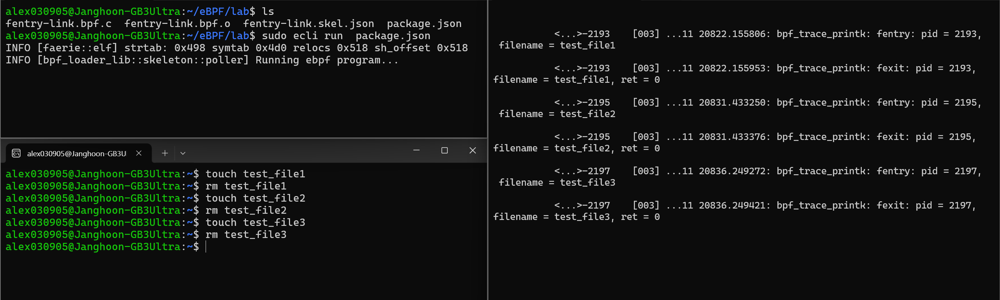

# fentry 기반 syscall 후킹

### fentry
fentry는 *ftrace hook 계열로, 커널 함수 진입 시점에 eBPF 프로그램을 실행할 수 있게 해준다.  

kprobe와는 다르게 *trampoline(트램폴린)을 사용하여 훨씬 가볍게 동작하므로 오버헤드가 작고 타입 안전성이 보장된다.  

>**ftrace 란?**  
frece(Function Tracer)는 리눅스 커널 내부 동작을 추적하고 분석하기 위한 강력한 도구이다. ftrace hook은 ftrace를 활용하는 후킹 방식을 묶어서 부르는 말이다.

>**trampoline 이란?**  
>trampoline은 짧은 점프 코드 조각을 가리킨다. 원래 함수가 호출될 때, 중간에 아주 작은 코드(trampoline)를 삽입하게 되는데,이 작은 코드가 원래 가려던 함수로 점프하기 전에 다른 동작(여기서는 eBPF 실행)을 끼워 넣는다.  
>
>정리하자면, 원래 호출 흐름을 바꾸지 않으면서 가볍게 후킹할 수 있도록 해주는 것이다.

<br>

kprobes와 달리 fentry/fexit 프로그램은 *BTF(BPF Type Format) 정보를 활용하여 함수 인자를 그대로 eBPF 프로그램의 파라미터로 전달받을 수 있다. 따라서 `pt_regs(kprobe에서 eBPF 프로그램이 받는 인자)`를 해석할 필요가 없고, 아키텍처에 의존하지 않아 유지보수성이 높다. 이러한 특성 덕에, 네트워크 처리와 같이 호출 빈도가 높은 코드 영역에서 활용된다.


>**BTF 란?**  
>BTF(BPF Type Format)는 커널 빌드 시 함수 시그니처(인자의 타입, 순서, 구조체 정보 등)를 담아둔 타입 메타데이터이다.  
>
>예시로 알아보면 이해가 쉽다.  
>
>eBPF 프로그램이 `SEC("fentry/tcp_v4_connect") int BPF_PROG(fn, struct sock *sk, int addrlen)` 처럼 정의되어 있다면, 커널은 BTF를 보고 tcp_v4_connect 함수가 어떤 인자를 받는지 알 수 있다. 이 정보를 바탕으로 eBPF 프로그램에 인자들을 그대로 전달해줄 수 있는 것이다.

<br>

특히, fexit 프로그램은 반환값만 접근할 수 있는 kretprobe와는 다르게 함수의 입력 매개변수뿐 아니라 반환값까지 직접 접근할 수 있다. 5.5 커널부터 eBPF 프로그램에서 fentry와 fexit를 사용할 수 있다.


### fentry-link.bpf.c 실습 파일

```c
#include "vmlinux.h"
#include <bpf/bpf_helpers.h>
#include <bpf/bpf_tracing.h>

char LICENSE[] SEC("license") = "Dual BSD/GPL";

SEC("fentry/do_unlinkat")
int BPF_PROG(do_unlinkat, int dfd, struct filename *name)
{
    pid_t pid;

    pid = bpf_get_current_pid_tgid() >> 32;
    bpf_printk("fentry: pid = %d, filename = %s\n", pid, name->name);
    return 0;
}

SEC("fexit/do_unlinkat")
int BPF_PROG(do_unlinkat_exit, int dfd, struct filename *name, long ret)
{
    pid_t pid;

    pid = bpf_get_current_pid_tgid() >> 32;
    bpf_printk("fexit: pid = %d, filename = %s, ret = %ld\n", pid, name->name, ret);
    return 0;
}
```

<br>

### 코드 분석
[이전 03강의 코드 분석](./03-Kprobe-Based-Syscall-Hooking.md#코드-분석)과 거의 유사한 코드로, 파일 삭제가 시작될 때 어떤 PID가 어떤 파일을 지우려 하는지 기록한다.   

`SEC("fentry/do_unlinkat")`는 `do_unlinkat` 함수 진입 시점에 eBPF 프로그램 실행한다는 의미이고 그때의 프로그램은 `int BPF_PROG(do_unlinkat, int dfd, struct filename *name)`이다.  

BTF 정보 덕분에 함수 원형 그대로 인자를 받을 수 있으며 어떤 PID가 어떤 파일을 지우려 하는지 전부 출력이 된다.  

<br>


### 컴파일 & 실행
ecc 로 컴파일을 해준 뒤,  
```bash
ecc fentry-link.bpf.c
```
<br>

ecli로 실행을 해주면 실행이 된다.  
```bash
sudo ecli run package.json
```
<br>

그리고 새로운 화면을 두개 켜준 뒤, 한 화면에서는 파일을 생성, 삭제해주고 다른 화면에서는 `sudo cat /sys/kernel/debug/tracing/trace_pipe` 를 실행하주면 된다.  

**화면 1**
```bash
sudo ecli run package.json
```
<br>

**화면 2**
```bash
touch test_file1
rm test_file1
touch test_file2
rm test_file2
```
<br>

**화면 3**
```bash
sudo cat /sys/kernel/debug/tracing/trace_pipe
```
<br>

**실행 결과**




이렇게 결과가 나오는 것을 확인할 수 있다.   

<br>

### 요약
fentry와 fexit를 사용하여 unlink 시스템 콜을 후킹하는 과정을 학습했다.  

kprobe 보다 아키텍처 의존성도 낮고, 성능 저하도 적은 특성 덕에 네트워크 목적에서 자주 쓰인다고 하니, 잘 기억해두는 것이 좋을 것 같다.  

<br>
<br>

## References

-  practice sequence : https://github.com/eunomia-bpf/bpf-developer-tutorial/blob/main/src/3-fentry-unlink/README.md
-  Compile and Run & fentry-link.bpf.c : https://github.com/eunomia-bpf/eunomia-bpf/tree/master/examples/bpftools/fentry-link