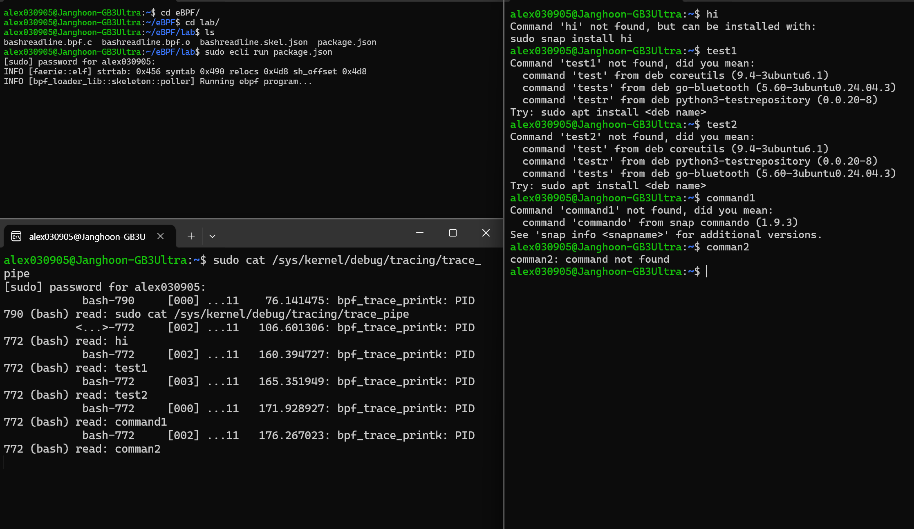

# uprobe 기반 함수 호출 캡처

### uprobe
uprobe는 커널 모드 대상이였던 tracepoint, fentry, kprobe랑 다르게 유저 공간 대상으로 실행된다.  

따라서 사용자 프로그램을 관찰할 때, 유저 함수 호출을 추적이 가능하고, 대상이 유저 모드인 만큼 안정성 또한 비교적 높다. 하지만 대상이 유저 모드이기 때문에 범위가 제한되고, 너무 많은 호출에 uprobe를 걸 시에 프로세스 실행 속도가 느려질 수 있다.  

uprobe는 파일 기반 프로브로, 특정 바이너리 함수에 걸면 그 파일을 사용하는 모든 프로세스(아직 실행되지 않은 프로세스 포함)까지 추적할 수 있다.  

덕분에 커널에서 직접 파싱하기 어려운 HTTP/2(헤더 인코딩), HTTPS(암호화) 같은 사용자 모드 트래픽을 관찰하는 데 적합하다. 예를 들어 SSL/TLS 평문 데이터를 여러 라이브러리에서 캡처할 때 사용될 수 있다.  

다만 커널 모드 eBPF 런타임에서 uprobe를 쓰면 상대적으로 성능 부담이 크다. 이런 경우에는 [bpftime](https://github.com/eunomia-bpf/bpftime)을 활용할 수 있다. bpftime은 커널 모드와 호환되면서도 커널과 유저 모드 전환을 줄여 실행 효율을 크게 높여준다.

<br>


### bashreadline.bpf.c 실습 파일

```c
#include <vmlinux.h>
#include <bpf/bpf_helpers.h>
#include <bpf/bpf_tracing.h>

#define TASK_COMM_LEN 16
#define MAX_LINE_SIZE 80

SEC("uretprobe//bin/bash:readline")
int BPF_KRETPROBE(printret, const void *ret)
{
 char str[MAX_LINE_SIZE];
 char comm[TASK_COMM_LEN];
 u32 pid;

 if (!ret)
  return 0;

 bpf_get_current_comm(&comm, sizeof(comm));
 
 pid = bpf_get_current_pid_tgid() >> 32;
 bpf_probe_read_user_str(str, sizeof(str), ret);

 bpf_printk("PID %d (%s) read: %s ", pid, comm, str);

 return 0;
};

char LICENSE[] SEC("license") = "GPL";
```

<br>

### 코드 분석
`SEC("uretprobe//bin/bash:readline")`는 uretprobe가 사용됐는데, 유저 공간 함수가 반환되는 시점을 트리거로 잡겠다는 뜻이다.  

`//bin/bash:readline`는 `/bin/bash` 실행 파일 안의 `readline` 함수가 리턴될 때 실행되므로 커널에서 아무 값을 입력하면 그 값을 읽어올 것이다.  

그리고 아래 `BPF_KRETPROB`를 통해 PID와 comm(실행되는 프로세스 이름. 여기선 bash), str(읽은 문자열)이 출력될 것이다.

<br>


### 컴파일 & 실행
ecc 로 컴파일을 해준 뒤,  
```bash
ecc bashreadline.bpf.c
```
<br>

ecli로 실행을 해주면 실행이 된다.  
```bash
sudo ecli run package.json
```
<br>


그리고 새로운 화면을 두개 켜준 뒤, 한 화면에서는 아무 텍스트를 입력해보고, 다른 화면에서는 `sudo cat /sys/kernel/debug/tracing/trace_pipe` 를 실행하주면 된다.  

**화면 1**
```bash
sudo ecli run package.json
```
<br>

**화면 2**
```bash
hi
test1
test2
command1
command2
```
<br>

**화면 3**
```bash
sudo cat /sys/kernel/debug/tracing/trace_pipe
```

### 실행 결과

  

이렇게 사용자의 입력이 출력되는 것을 볼 수 있다.  


<br>

### 요약
사용자 공간에서 bash의 readline 함수를 읽어오는 실습을 해봤다. 이렇게 유저 공간 함수 호출을 캡처하여 사용자의 동작을 관찰하는 것은 보안 모니터링에서도 중요하게 사용되고, HTTP나 HTTP2 처럼 커널에서 바로 파싱하기 어려운 트래픽 분석에서도 응용할 수 있다고 한다. uprobe 기반 접근은 실제 환경에서 자주 활용되는 중요한 도구라 할 수 있다.  


<br>
<br>


## References

-  practice sequence : https://github.com/eunomia-bpf/bpf-developer-tutorial/blob/main/src/3-fentry-unlink/README.md
-  Compile and Run & bashreadline.bpf.c : https://github.com/eunomia-bpf/eunomia-bpf/tree/master/examples/bpftools/bashreadline