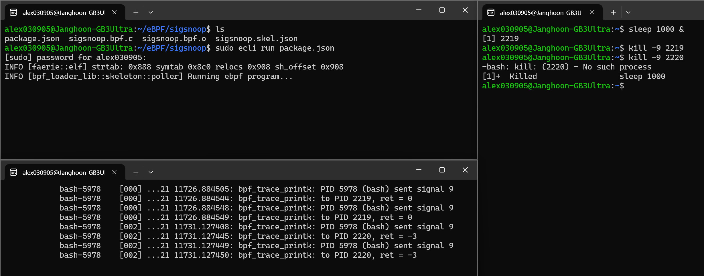

# Hashmap을 사용한 signal snooping

### sigsnoop

이번 실습은 프로세스에 signal를 보내는 syscall을 스누핑하여 해시맵을 사용하여 상태를 저장하는 방법을 소개한다. 


<br>


### sigsnoop.bpf.c 실습 파일

```c
#include <vmlinux.h>
#include <bpf/bpf_helpers.h>
#include <bpf/bpf_tracing.h>

#define MAX_ENTRIES 10240
#define TASK_COMM_LEN 16

struct event {
 unsigned int pid;
 unsigned int tpid;
 int sig;
 int ret;
 char comm[TASK_COMM_LEN];
};

struct {
 __uint(type, BPF_MAP_TYPE_HASH);
 __uint(max_entries, MAX_ENTRIES);
 __type(key, __u32);
 __type(value, struct event);
} values SEC(".maps");


static int probe_entry(pid_t tpid, int sig)
{
 struct event event = {};
 __u64 pid_tgid;
 __u32 tid;

 pid_tgid = bpf_get_current_pid_tgid();
 tid = (__u32)pid_tgid;
 event.pid = pid_tgid >> 32;
 event.tpid = tpid;
 event.sig = sig;
 bpf_get_current_comm(event.comm, sizeof(event.comm));
 bpf_map_update_elem(&values, &tid, &event, BPF_ANY);
 return 0;
}

static int probe_exit(void *ctx, int ret)
{
 __u64 pid_tgid = bpf_get_current_pid_tgid();
 __u32 tid = (__u32)pid_tgid;
 struct event *eventp;

 eventp = bpf_map_lookup_elem(&values, &tid);
 if (!eventp)
  return 0;

 eventp->ret = ret;
 bpf_printk("PID %d (%s) sent signal %d ",
           eventp->pid, eventp->comm, eventp->sig);
 bpf_printk("to PID %d, ret = %d",
           eventp->tpid, ret);

cleanup:
 bpf_map_delete_elem(&values, &tid);
 return 0;
}

SEC("tracepoint/syscalls/sys_enter_kill")
int kill_entry(struct trace_event_raw_sys_enter *ctx)
{
 pid_t tpid = (pid_t)ctx->args[0];
 int sig = (int)ctx->args[1];

 return probe_entry(tpid, sig);
}

SEC("tracepoint/syscalls/sys_exit_kill")
int kill_exit(struct trace_event_raw_sys_exit *ctx)
{
 return probe_exit(ctx, ctx->ret);
}

char LICENSE[] SEC("license") = "Dual BSD/GPL";
```

<br>

### 코드 분석  

먼저 코드의 전체적인 흐름부터 설명하자면, kill() 시스템콜이 호출될 때 호출한 pid가 누구에게 (tpid) 어떤 시그널(sig)을 보내고 결과가(ret)가 어떻게 나왔는지 알려준다.   

```c
struct event {
 unsigned int pid;
 unsigned int tpid;
 int sig;
 int ret;
 char comm[TASK_COMM_LEN];
};

struct {
 __uint(type, BPF_MAP_TYPE_HASH);
 __uint(max_entries, MAX_ENTRIES);
 __type(key, __u32);
 __type(value, struct event);
} values SEC(".maps");
```

위 구조체를 보면  `__uint(type, BPF_MAP_TYPE_HASH);`에서 해시맵으로 `evnet` 구조체를 value 값에 넣는다는 것을 알 수 있다.   

<br>

```c
static int probe_entry(pid_t tpid, int sig)
{
 struct event event = {};
 __u64 pid_tgid;
 __u32 tid;

 pid_tgid = bpf_get_current_pid_tgid();
 tid = (__u32)pid_tgid;
 event.pid = pid_tgid >> 32;
 event.tpid = tpid;
 event.sig = sig;
 bpf_get_current_comm(event.comm, sizeof(event.comm));
 bpf_map_update_elem(&values, &tid, &event, BPF_ANY);
 return 0;
}
```

위 함수를 보면 `bpf_get_current_pid_tgid();`가 나오는데, 이건 상위 32비트에는 PID를 하위 32비트에는 tid를 쓰는 함수이다. 그렇게 얻어낸 pid와 함께 인수로 받았던 tpid 와 sig를 event 구조체에 넣고 해시맵 value에 저장한다. 여기서 `bpf_map_update_elem`는 `long bpf_map_update_elem(struct bpf_map *map, const void *key, const void *value, u64 flags)` 꼴이며 values는 이전에 event 구조체를 정의할 때 바로 아래 위치에서 정의한 구조체의 마지막에 values 로 해시맵임을 정의해두었었다. 그렇게 tid가 key값, event 구조체가 value 값인 해시맵을 만들어낸다.   

<br>

```c
static int probe_exit(void *ctx, int ret)
{
 __u64 pid_tgid = bpf_get_current_pid_tgid();
 __u32 tid = (__u32)pid_tgid;
 struct event *eventp;

 eventp = bpf_map_lookup_elem(&values, &tid);
 if (!eventp)
  return 0;

 eventp->ret = ret;
 bpf_printk("PID %d (%s) sent signal %d ",
           eventp->pid, eventp->comm, eventp->sig);
 bpf_printk("to PID %d, ret = %d",
           eventp->tpid, ret);

cleanup:
 bpf_map_delete_elem(&values, &tid);
 return 0;
}
```
위 함수도 마찬가지로 `bpf_get_current_pid_tgid`를 통해 pid와 tid를 얻어낸다. 이후  `eventp = bpf_map_lookup_elem(&values, &tid);`로 해당 tid(key값)를 통해 value를 찾아낸다.  

그리고 인수로 들고온 리턴값(ret)을 ret 필드에 저장하고 문자열을 출력한다. 출력하는 것은 아래와 같다.   

- `PID <pid> (<comm>) sent signal <sig> to PID <pid>, ret = <ret>`


<br>

```c
SEC("tracepoint/syscalls/sys_enter_kill")
int kill_entry(struct trace_event_raw_sys_enter *ctx)
{
 pid_t tpid = (pid_t)ctx->args[0];
 int sig = (int)ctx->args[1];

 return probe_entry(tpid, sig);
}

SEC("tracepoint/syscalls/sys_exit_kill")
int kill_exit(struct trace_event_raw_sys_exit *ctx)
{
 return probe_exit(ctx, ctx->ret);
}
```

이제 익숙한 형태의 함수가 나왔다. `tracepoint/syscalls/sys_enter_kill`에 붙을 eBPF 프로그램으로, `sys_enter_kill` tracepoint가 활성될 때 (즉, kill이 호출될 때) tpid와 sig를 가져와서 probe_entry 함수의 인자로 넘겨 호출한다.  

아래에는 `tracepoint/syscalls/sys_exit_kill`에 붙을 eBPF 프로그램으로, `sys_exit_kill` tracepoint를 지날 때 (즉, kill syscall을 끝내고 돌아갈 때) 리턴값을 인자로 probe_exit 함수를 호출한다.  

이러한 흐름으로 처음 말했던대로 kill() 시스템콜이 호출될 때 호출한 pid가 누구에게 (tpid) 어떤 시그널(sig)을 보내고 결과가(ret)가 어떻게 나왔는지 알려주게 된다.  


<br>


### 컴파일 & 실행
ecc 로 컴파일을 해준 뒤,  
```bash
ecc sigsnoop.bpf.c
```
<br>

ecli로 실행을 해주면 실행이 된다.  
```bash
sudo ecli run package.json
```
<br>


그리고 새로운 화면을 두개 켜준 뒤, 한 화면에서는 `sudo cat /sys/kernel/debug/tracing/trace_pipe` 를 실행해주고, 다른 한 화면에서 `sleep 1000`가 실행되는 pid (target pid)를 기억해둔다. 그리고 kill 9번 시그널로 tpid를 종료를 시켜본다. 그리고 존재하지않는 아무 tpid에개도 똑같이 날려본다.  

**화면 1**
```bash
sudo ecli run package.json
```
<br>

**화면 2**
```bash
sudo cat /sys/kernel/debug/tracing/trace_pipe
```
<br>

**화면 3**
```bash
sleep 1000 & echo $!
kill -9 2219
kill -9 2220
```  

<br>

### 실행 결과



이렇게 5978 PID가 sleep를 실행중이였던 2219 PID 에게 9번 시그널을 보낸 것이 로그에 남았다. 그리고 제대로 실행되었으므로 0을 리턴했다. 하지만 존재하지 않는 2220 PID에게 9번 시그널을 날리니 `-ESRCH` 에 해당하는 -3 리턴값을 받은 것이다.  


<br>


### 요약
오늘은 eBPF를 이용해 사용자 공간에서 발생하는 시그널 전달 과정을 관찰하는 실습을 진행헀다. syscall을 해시맵을 사용하여 저장을 하는 방식을 알아봤으며, 해시맵을 사용하기 위해서는 오늘처럼 아래와 같은 구조체를 정의해주어야한다고 한다.  

```c
struct {
 __uint(type, BPF_MAP_TYPE_HASH);
 __uint(max_entries, MAX_ENTRIES);
 __type(key, __u32);
 __type(value, struct event);
} values SEC(".maps");
```
  
그리고 `bpf_map_lookup_elem`, `bpf_map_update_elem`, `bpf_map_delete_elem` 과 같은 해당 함수에 대해서도 함께 알아봤다. 이러한 시스템콜 모니터링 방식은 사용자 행위를 분석하거나 비정상적인 시그널 전송을 탐지하는데 유용하게 활용된다고 한다. 


<br>
<br>


## References

-  practice sequence : https://github.com/eunomia-bpf/eunomia-bpf/tree/master/examples/bpftools/sigsnoop
-  Compile and Run & sigsnoop.bpf.c : https://github.com/eunomia-bpf/bpf-developer-tutorial/blob/main/src/6-sigsnoop/README.md

  