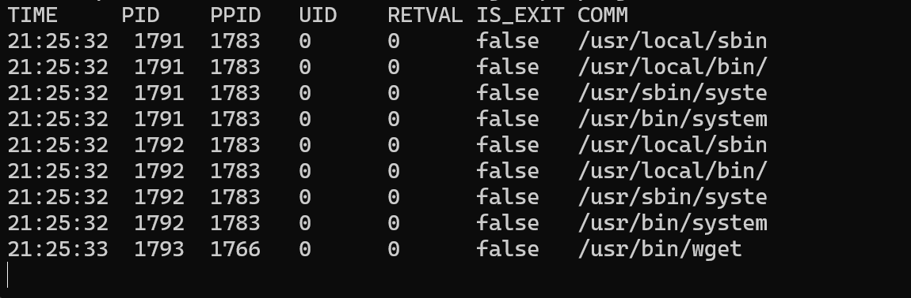

# perf event array를 활용한 프로세스 실행 캡쳐


### perf buffer  

ebpf 프로그램이 커널에서 수집한 데이터를 유저 공간으로 전송해야할 때, bpk_printk만으로는 성능과 기능면에서 부족하다. 이때 데이터를 효율적으로 주고받기 위해 perf buffer를 활용한다.  

버퍼가 필요한 이유는 ebpf가 커널 내에서 실행되므로 유저 공간에 데이터를 보낼 때 고성능 통신 채널이 필요하다. 이를 위해 ebpf 는 두가지 유형의 링버퍼를 제공하며, 자세한 내용은 아래 표로 정리해보았다.  


| 구분    | Perf Event Array         | BPF Ring Buffer        |
| ----- | ------------------------ | ---------------------- |
| 도입 버전 | 커널 4.15 이상               | 커널 5.8 이상              |
| 특징    | CPU마다 개별 버퍼 할당 (Per-CPU) | 모든 CPU가 공유하는 단일 버퍼     |
| 장점    | 호환성 범위가 매우 넓음            | 메모리 효율성 및 데이터 순서 보장 우수 |
| 단점    | 데이터 순서 뒤섞임 발생 가능         | 최신 커널 환경 필요            |

<br>

### 실습 코드  

**execsnoop.h**

```c
#ifndef __EXECSNOOP_H
#define __EXECSNOOP_H

#define TASK_COMM_LEN 16

struct event {
    int pid;
    int ppid;
    int uid;
    int retval;
    bool is_exit;
    char comm[TASK_COMM_LEN];
};

#endif /* __EXECSNOOP_H */
```

이 코드는 event 구조체를 정의한다.   
ABI 헤더파일이라고도 부르며, 커널과 유저 사이에서 구조를 정의해주는 파일이다.  

이전에 06 실습에서는 구조체는 bpf.c 파일에 함께 넣었는데, 이번에 따로 정의한 이유를 찾아보니  
커널에서 해시맵에 값을 누적하고, 유저공간에서 주기적으로 맵을 읽는 구조였던 반면에  
이번에는 커널에서 이벤트 기록들을 푸시하고 유저공간에서 이를 실시간으로 수신하기 떄문이다.  
이런 구조에서는 구조체 공유 필요성이 높기때문에 헤더파일로 분리해두는 것이라고 한다.  


<br>

**execsnoop.bpf.c**

```c
#include <vmlinux.h>
#include <bpf/bpf_helpers.h>
#include <bpf/bpf_core_read.h>
#include "execsnoop.h"

struct {
    __uint(type, BPF_MAP_TYPE_PERF_EVENT_ARRAY);
    __uint(key_size, sizeof(u32));
    __uint(value_size, sizeof(u32));
} events SEC(".maps");

SEC("tracepoint/syscalls/sys_enter_execve")
int tracepoint_syscalls_sys_enter_execve(struct trace_event_raw_sys_enter* ctx)
{
    u64 id;
    pid_t pid, tgid;
    struct event event={0};
    struct task_struct *task;

    uid_t uid = (u32)bpf_get_current_uid_gid();
    id = bpf_get_current_pid_tgid();
    tgid = id >> 32;

    event.pid = tgid;
    event.uid = uid;
    task = (struct task_struct*)bpf_get_current_task();
    event.ppid = BPF_CORE_READ(task, real_parent, tgid);
    char *cmd_ptr = (char *) BPF_CORE_READ(ctx, args[0]);
    bpf_probe_read_str(&event.comm, sizeof(event.comm), cmd_ptr);
    bpf_perf_event_output(ctx, &events, BPF_F_CURRENT_CPU, &event, sizeof(event));
    return 0;
}
```

<br>

### 코드 분석

우선 events 라는 bpf 맵을 하나 정의했다.  
`BPF_MAP_TYPE_PERF_EVENT_ARRAY` 타입으로 정의한 것을 볼 수 있는데, 이건 커널공간에서 유저공간으로 데이터를 보내기 위해 사용하는 타입이다.   

`SEC("tracepoint/syscalls/sys_enter_execve")`에서 `sys_enter_execve` 시스템 콜에 붙는 다는 것을 알 수 있다.  

그리고 각 변수&구조체가 어떤 값을 가지는지 정리해보면  
- `id` : `bpf_get_current_pid_tgid()`의 반환값을 담음
- `pid` `tgid` : pid와 tgid를 담는 변수이지만 pid는 실제로 사용하진 않음
  - `tgid`는 `id`의 상위 32비트
- `uid` : `bpf_get_current_uid_gid()`의 반환값 중 하위 32비트를 담음
- `event` : event 구조체를 0으로 초기화함

이제 event 구조체에 들어간 값을 보면  
- `pid` : tgid
- `ppid` : 부모의 tgid`
  -  `event.ppid = BPF_CORE_READ(task, real_parent, tgid);`로 task->real_parent은 부모테스크를 가리키는 포인터이다.  
- `uid` : uid
- `comm` : 
  - `bpf_probe_read_str(&event.comm, sizeof(event.comm), cmd_ptr);`로 유저 공간 메모리에서 문자열을 읽어오는 헬퍼라고 한다. 인자는 순서대로 목적지 버퍼 주소, 목적지 버퍼 크기, 읽어올 문자열 소스 포인터이다. 여기서 cmd_ptr은 `  char *cmd_ptr = (char *) BPF_CORE_READ(ctx, args[0]);` 이거로 `sys_enter_execve`의 첫번째 인자인 파일 이름이 들어간다.   

이제 마무리로 `bpf_perf_event_output(ctx, &events, BPF_F_CURRENT_CPU, &event, sizeof(event));` 으로 아까 읽고 기록했던 events 맵을 반환한다.   

retval과 is_exit 값이 각각 0과 false(0)으로 고정되는 이유는 `sys_enter_execve`로 진입시점에 붙인 코드이기 때문에 리턴값이 없고, exit가 아니라 0이 붙는 것이다.  

<br>

### 컴파일 & 실행
ecc 로 컴파일을 해준 뒤,  
```bash
ecc execsnoop.bpf.c execsnoop.h
```
<br>

ecli로 실행을 해주면 실행이 된다.  
```bash
sudo ecli run package.json
```
<br>


### 실행 결과

  

```
TIME   PID   PPID   UID   RETVAL   IS_EXIT   COMM
```

결과를 보면 이렇게 위 형식에 맞게 각 값들이 나오는 것을 확인할 수 있다.  
시간에 맞춰 어떤 파일을 실행했는지 pid와 ppid uid가 출력된다.  

COMM은 실행되는 파일명이고, `#define TASK_COMM_LEN 16`로 선언을 해서 16자를 넘어가면 문자열이 잘리게 된다. 또한  `sys_enter_execve`에 프로그램을 붙였기 때문에 RETVAL IS_EXIT은 0과 false로 고정된 값이 나오는 것도 볼 수 있다.  


<br>


### 요약
오늘은 perf event array를 활용하여 실행중인 프로세스의 이벤트를 캡처하고 출력하는 것을 알아보았다. 사용자 공간으로 정보를 전송한 후에 데이터 처리 및 분석을 수행할 수 있다고 한다.  

```c
struct {
 __uint(type, BPF_MAP_TYPE_PERF_EVENT_ARRAY);
 __uint(key_size, sizeof(u32));
 __uint(value_size, sizeof(u32));
} events SEC(".maps");
```
위 방법으로 구조체와 헤더 파일을 정의할 수 있었으며 이를 통해 정보를 사용자 공간으로 전송할 수 있었다.  


<br>
<br>

### Reference

- BPF_MAP_TYPE_PERF_EVENT_ARRAY : https://docs.ebpf.io/linux/map-type/BPF_MAP_TYPE_PERF_EVENT_ARRAY/
- 