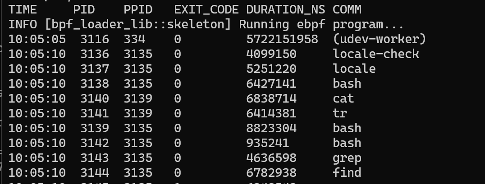

# ring buffer를 활용한 프로세스 종료 캡쳐


### Ring Buffer    

지난 시간에 다루었던 Perf event array는 각 CPU 코어마다 독립된 버퍼를 가진다. 이 방식은 메모리 낭비와 데이터의 순서가 꼬일 수 있는 문제점이 있다.  

이 문제를 해결하기 위해 커널 5.8 버전부터 Ring Buffer가 추가되었다.  

Ring buffer는 고정된 크기의 메모리 공간을 원형으로 순환하며 사용하는 자료구조이다. 버퍼의 끝에 데이터가 차면 다시 첫번째 공간으로 돌아가서 데이터를 사용한다.  

ebpf에서 Ring Buffer는 모든 CPU가 공유한다. 이로써 FIFO를 보장하여 데이터 순서 꼬임 문제와 메모리 낭비 문제를 해결한다. 데이터를 전송할 때 사용하는 주요 함수 몇가지를 알아보고 실습으로 넘어가보자.  

- void *bpf_ringbuf_reserve(void *ringbuf, u64 size, u64 flags)
  - 버퍼에 데이터를 기록하기 위해 공간을 미리 예약하는 함수
  - ringbuf : 데이터를 보낼 링 버퍼 map
  - size : 해당 구조체의 크기
  - flags : 사용자 공간을 깨우는 알림 방식 (기본 알림 정책은 0)  


- void bpf_ringbuf_submit(void *data, u64 flags)
  - 데이터 기록이 완료되었음을 알리고 유저 공간에서 읽을 수 있도록 커밋하는 함수  
  - data : bpf_ringbuf_reserve을 통해 할당받았던 메모리 주소 
  - flags : 이전과 동일. 알림 방식인데 주로 기본 정책인 0을 씀


<br>

### 실습 코드  

**exitsnoop.h**  

```c
#ifndef __BOOTSTRAP_H
#define __BOOTSTRAP_H

#define TASK_COMM_LEN 16
#define MAX_FILENAME_LEN 127

struct event {
    int pid;
    int ppid;
    unsigned exit_code;
    unsigned long long duration_ns;
    char comm[TASK_COMM_LEN];
};

#endif /* __BOOTSTRAP_H */
```

이전과 비슷하게 ABI헤더파일이 있다.  

커널과 유저공간에서 동일한 데이터 규격을 공유할 수 있으며, 구조체에서 정보를 추가하거나 수정할 것이 생겨도 쉽게 확장할 수 있다.  

<br>


**exitsnoop.bpf.c**
```c
#include "vmlinux.h"
#include <bpf/bpf_helpers.h>
#include <bpf/bpf_tracing.h>
#include <bpf/bpf_core_read.h>
#include "exitsnoop.h"

char LICENSE[] SEC("license") = "Dual BSD/GPL";

struct {
    __uint(type, BPF_MAP_TYPE_RINGBUF);
    __uint(max_entries, 256 * 1024);
} rb SEC(".maps");

SEC("tp/sched/sched_process_exit")
int handle_exit(struct trace_event_raw_sched_process_template* ctx)
{
    struct task_struct *task;
    struct event *e;
    pid_t pid, tid;
    u64 id, ts, *start_ts, start_time = 0;
    
    /* get PID and TID of exiting thread/process */
    id = bpf_get_current_pid_tgid();
    pid = id >> 32;
    tid = (u32)id;

    /* ignore thread exits */
    if (pid != tid)
        return 0;

    /* reserve sample from BPF ringbuf */
    e = bpf_ringbuf_reserve(&rb, sizeof(*e), 0);
    if (!e)
        return 0;

    /* fill out the sample with data */
    task = (struct task_struct *)bpf_get_current_task();
    start_time = BPF_CORE_READ(task, start_time);

    e->duration_ns = bpf_ktime_get_ns() - start_time;
    e->pid = pid;
    e->ppid = BPF_CORE_READ(task, real_parent, tgid);
    e->exit_code = (BPF_CORE_READ(task, exit_code) >> 8) & 0xff;
    bpf_get_current_comm(&e->comm, sizeof(e->comm));

    /* send data to user-space for post-processing */
    bpf_ringbuf_submit(e, 0);
    return 0;
}
```


<br>

### 코드 분석

rb 라는 bpf 맵을 하나 정의했다.  
`BPF_MAP_TYPE_RINGBUF` 타입으로 선언했는데, 커널에서 유저공간으로 데이터를 보내기 위해 Ring buffer를 사용하려는 것으로 보인다.  

`SEC("tp/sched/sched_process_exit")`에서 알 수 있듯이 `sched_process_exit` 프로세스 종료 시점인 tracepoint에 해당 코드를 붙이려는 것을 알 수 있다.  

변수에 대해 알아보자면 아래와 같다.  
- `id` : bpf_get_current_pid_tgid()
- `pid` : `id`의 상위 32비트 = tgid
- `tid` : `id`의 하위 32비트 = pid


그리거 pid랑 tid랑 다를 때는 thread exit로 간주하여 무시한다 되어있는데, 이건 위 변수에서 알 수 있듯이 `pid != tid` 는 커널 내부에서의 `tgid != pid`와 같은 뜻이다. 커널 관점에서 `tgid != pid`는 서브스레드일 때를 의미하며, 정리하자면 메인 스레드일 때만 코드를 실행하겠다는 것이다. 즉 프로세스가 종료되었을 때 실행하는 코드인 것이다.  

`e = bpf_ringbuf_reserve(&rb, sizeof(*e), 0)`를 통해 구조체 e를 링 버퍼에 넣을 자리를 예약한다. 만약 자리가 없다면 if !e 에서 걸리게되어 종료된다.  

- `task` : `bpf_get_current_task()`를 통해 현재 테스크 정보를 가져옴
- `start_time` : task에서 시작 시간을 읽음


잔송할 정보는 e에 채워넣는다.  

- `duration_ns` : 현재시간(bpf_ktime_get_ns) - 시작시간(start_time)으로 실행시간을 계산
- `pid` : pid
- `ppid` : tgid
- `exit_code` : 종료 코드 추출
  - `(BPF_CORE_READ(task, exit_code) >> 8) & 0xff;` 프로세스 종료 상태값은 두번째 바이트에 저장된다고 한다. 따라서 오른쪽으로 8칸 밀고 앞의 1바이트를 잘라내는 마스크 연산을 수행한 것이다.  
- `comm` : 현재 실행중인 프로세스의 이름을 가져옴

이렇게 보낼 정보들을 구조체 e에 모았다면 `bpf_ringbuf_submit(e, 0);`를 통해 전송한다.  


<br>


### 컴파일 & 실행
ecc 로 컴파일을 해준 뒤,  
```bash
ecc exitsnoop.bpf.c exitsnoop.h
```
<br>

ecli로 실행을 해주면 실행이 된다.  
```bash
sudo ecli run package.json
```
<br>

### 실행 결과



```
TIME   PID   PPID   EXIT_CODE   DURATION_NS   COMM
```

결과를 보면 이렇게 위 형식에 맞게 각 값들이 나오는 것을 확인할 수 있다.  

EXIT_CODE를 통해서 프로그램이 정상 종료(0)되었는지 에러가 발생했는지도 바로 파악할 수 있다. 이 부분은 bpf_printk로는 구현하기 힘든 모니터링의 기초 기능이라 볼 수 있다.  


<br>


### 요약  


오늘은 Ring Buffer를 활용하여 프로세스의 종료를 모니터링하고 전송하는 것을 알아보았다. Ring Buffer는 FIFO를 보장하고 효율적으로 전송을 구현할 수 있었다. 

```c
struct {
    __uint(type, BPF_MAP_TYPE_RINGBUF);
    __uint(max_entries, 256 * 1024);
} rb SEC(".maps");
```

위 코드로 데이터를 전달할 map을 정의할 수 있었다. 여기에 ABI 헤더 파일의 구조체를 결합하여, 커널과 유저가 오차 없이 데이터를 주고받을 수 있었다.

<br>
<br>

### Reference   

- Ring Buffer : https://en.wikipedia.org/wiki/Circular_buffer

- BPF_MAP_TYPE_RINGBUF : https://docs.ebpf.io/linux/map-type/BPF_MAP_TYPE_RINGBUF/

- practice sequence : https://github.com/eunomia-bpf/bpf-developer-tutorial/blob/main/src/8-exitsnoop/README.md