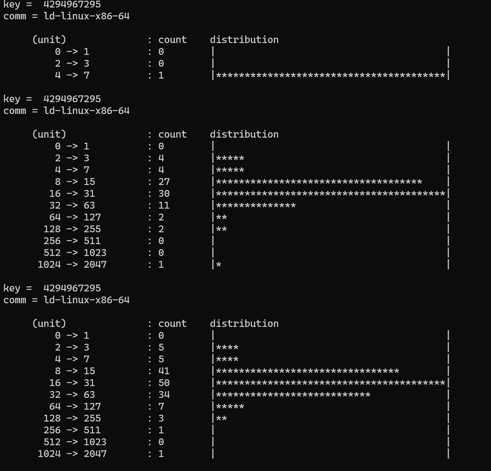

# Capturing Scheduling Latency & visualization record


### runqlat (RUN Queue LATency)

runqlat은 리눅스의 CPU 스케줄러 지연 시간을 측정하는 eBPF 성능 분석 도구이다. runqlat은 리눅스 커널의 스케줄러 이벤트에 훅을 걸어 작동한다.  

프로세스는 sleep에서 깨어난 이후 아래와 같은 흐름을 거친다.  
- Runnable 상태
- Run Queue에 등록 (아직 실행 중은 아님)
- 스케줄러에 의해 선택
- CPU에서 실행

이때 Run Queue Latency는 Run Queue에 들어간 시점부터 CPU에서 실행되기까지의 시간을 측정한 것이다.   

아래와 같이 결과가 나온다.  
```
# runqlat
Tracing run queue latency... Hit Ctrl-C to end.
^C
     usecs               : count     distribution
         0 -> 1          : 233      |***********                             |
         2 -> 3          : 742      |************************************    |
         4 -> 7          : 203      |**********                              |
         8 -> 15         : 173      |********                                |
        16 -> 31         : 24       |*                                       |
        32 -> 63         : 0        |                                        |
        64 -> 127        : 30       |*                                       |
       128 -> 255        : 6        |                                        |
       256 -> 511        : 3        |                                        |
       512 -> 1023       : 5        |                                        |
      1024 -> 2047       : 27       |*                                       |
```

<br>

### 실습 코드   

**runqlat.h**   

```c
/* SPDX-License-Identifier: (LGPL-2.1 OR BSD-2-Clause) */
#ifndef __RUNQLAT_H
#define __RUNQLAT_H

#define TASK_COMM_LEN 16
#define MAX_SLOTS 26

struct hist {
    __u32 slots[MAX_SLOTS];
    char comm[TASK_COMM_LEN];
};

#endif /* __RUNQLAT_H */
```

<br>

**runqlat.bpf.c**  

```c
// SPDX-License-Identifier: GPL-2.0
// Copyright (c) 2020 Wenbo Zhang
#include <vmlinux.h>
#include <bpf/bpf_helpers.h>
#include <bpf/bpf_core_read.h>
#include <bpf/bpf_tracing.h>
#include "runqlat.h"
#include "bits.bpf.h"
#include "maps.bpf.h"
#include "core_fixes.bpf.h"

#define MAX_ENTRIES 10240
#define TASK_RUNNING  0

const volatile bool filter_cg = false;
const volatile bool targ_per_process = false;
const volatile bool targ_per_thread = false;
const volatile bool targ_per_pidns = false;
const volatile bool targ_ms = false;
const volatile pid_t targ_tgid = 0;

struct {
 __uint(type, BPF_MAP_TYPE_CGROUP_ARRAY);
 __type(key, u32);
 __type(value, u32);
 __uint(max_entries, 1);
} cgroup_map SEC(".maps");

struct {
 __uint(type, BPF_MAP_TYPE_HASH);
 __uint(max_entries, MAX_ENTRIES);
 __type(key, u32);
 __type(value, u64);
} start SEC(".maps");

static struct hist zero;

/// @sample {"interval": 1000, "type" : "log2_hist"}
struct {
 __uint(type, BPF_MAP_TYPE_HASH);
 __uint(max_entries, MAX_ENTRIES);
 __type(key, u32);
 __type(value, struct hist);
} hists SEC(".maps");

static int trace_enqueue(u32 tgid, u32 pid)
{
u64 ts;

if (!pid)
  return 0;
if (targ_tgid && targ_tgid != tgid)
  return 0;

ts = bpf_ktime_get_ns();
bpf_map_update_elem(&start, &pid, &ts, BPF_ANY);
return 0;
}

static unsigned int pid_namespace(struct task_struct *task)
{
struct pid *pid;
unsigned int level;
struct upid upid;
unsigned int inum;

/*  get the pid namespace by following task_active_pid_ns(),
 *  pid->numbers[pid->level].ns
 */
pid = BPF_CORE_READ(task, thread_pid);
level = BPF_CORE_READ(pid, level);
bpf_core_read(&upid, sizeof(upid), &pid->numbers[level]);
inum = BPF_CORE_READ(upid.ns, ns.inum);

return inum;
}

static int handle_switch(bool preempt, struct task_struct *prev, struct task_struct *next)
{
struct hist *histp;
u64 *tsp, slot;
u32 pid, hkey;
s64 delta;

if (filter_cg && !bpf_current_task_under_cgroup(&cgroup_map, 0))
  return 0;

if (get_task_state(prev) == TASK_RUNNING)
  trace_enqueue(BPF_CORE_READ(prev, tgid), BPF_CORE_READ(prev, pid));

pid = BPF_CORE_READ(next, pid);

tsp = bpf_map_lookup_elem(&start, &pid);
if (!tsp)
  return 0;
delta = bpf_ktime_get_ns() - *tsp;
if (delta < 0)
  goto cleanup;

if (targ_per_process)
  hkey = BPF_CORE_READ(next, tgid);
else if (targ_per_thread)
  hkey = pid;
else if (targ_per_pidns)
  hkey = pid_namespace(next);
else
  hkey = -1;
histp = bpf_map_lookup_or_try_init(&hists, &hkey, &zero);
if (!histp)
  goto cleanup;
if (!histp->comm[0])
  bpf_probe_read_kernel_str(&histp->comm, sizeof(histp->comm),
     next->comm);
if (targ_ms)
  delta /= 1000000U;
else
  delta /= 1000U;
slot = log2l(delta);
if (slot >= MAX_SLOTS)
  slot = MAX_SLOTS - 1;
__sync_fetch_and_add(&histp->slots[slot], 1);

cleanup:
bpf_map_delete_elem(&start, &pid);
return 0;
}

SEC("raw_tp/sched_wakeup")
int BPF_PROG(handle_sched_wakeup, struct task_struct *p)
{
 if (filter_cg && !bpf_current_task_under_cgroup(&cgroup_map, 0))
  return 0;

 return trace_enqueue(BPF_CORE_READ(p, tgid), BPF_CORE_READ(p, pid));
}

SEC("raw_tp/sched_wakeup_new")
int BPF_PROG(handle_sched_wakeup_new, struct task_struct *p)
{
 if (filter_cg && !bpf_current_task_under_cgroup(&cgroup_map, 0))
  return 0;

 return trace_enqueue(BPF_CORE_READ(p, tgid), BPF_CORE_READ(p, pid));
}

SEC("raw_tp/sched_switch")
int BPF_PROG(handle_sched_switch, bool preempt, struct task_struct *prev, struct task_struct *next)
{
 return handle_switch(preempt, prev, next);
}

char LICENSE[] SEC("license") = "GPL";
```


<br>

### 코드 분석


```c
struct {
 __uint(type, BPF_MAP_TYPE_CGROUP_ARRAY);
 __type(key, u32);
 __type(value, u32);
 __uint(max_entries, 1);
} cgroup_map SEC(".maps");

struct {
 __uint(type, BPF_MAP_TYPE_HASH);
 __uint(max_entries, MAX_ENTRIES);
 __type(key, u32);
 __type(value, u64);
} start SEC(".maps");

static struct hist zero;

/// @sample {"interval": 1000, "type" : "log2_hist"}
struct {
 __uint(type, BPF_MAP_TYPE_HASH);
 __uint(max_entries, MAX_ENTRIES);
 __type(key, u32);
 __type(value, struct hist);
} hists SEC(".maps");
```

우선 `cgroup_map`, `start`, `hist` 라는 세가지 map을 정의한다.  

각각 구조를 살표보면  
- `cgroup_map` 
  - Type : `BPF_MAP_TYPE_CGROUP_ARRAY`
  - map 기능 : cgroup의 식별자를 저장하고 관리하기 위해 사용하는 맵
  - 설명 : max_entries이 1인것을 보아 하나의 cgroup에 대해 지속적인 관찰이 가능
- `start`
  - Type : `BPF_MAP_TYPE_HASH`
  - 설명 : runqlat은 Run Queue에 들어간 시점부터 CPU에서 실행되기까지의 시간을 재는 것이 목표임. 이때 Run queue에 들어올 때 각 프로세스의 시간을 정확히 기록하는 것이 목표임.
- `hist`
  - Type : `BPF_MAP_TYPE_HASH`
  - 설명 : Run queue에 들어간 시간대와 실행된 현재시간의 차를 계산하여, 프로세스가 기다린 시간을 시간대 구간에 넣어 기록하는 역할. 


*세가지 map이 사용되는 방법*  
runqlat은 Run Queue에 들어간 시점부터 CPU에서 실행되기까지의 시간을 잰 뒤 이를 시각화하여 보여주는 것이 목표이다. 이를 위해 cgroup_map이 추적하고자 하는 특정 그룹을 필터링해주는 역할을 하고, 해당 그룹의 프로세스가 Run queue에 들어가는 순간 start map에 기록된다. 이후 스케줄러가 프로세스를 선택하여 실제로 CPU에서 실행될 때 start map에 기록된 기록을 꺼내 현재 시간과 차이를 구한 뒤 hists 맵의 알맞은 시간 구간으로 들어간다.  

나머지 코드를 읽어보며 위 흐름을 확인해보자.  
<br>

```c
static int trace_enqueue(u32 tgid, u32 pid)
{
u64 ts;

if (!pid)
  return 0;
if (targ_tgid && targ_tgid != tgid)
  return 0;

ts = bpf_ktime_get_ns();
bpf_map_update_elem(&start, &pid, &ts, BPF_ANY);
return 0;
}
```
인자로 tgid와 pid를 받는데, CPU가 다른 작업을 수행할 것이 없을 때 나오는 pid=0 일 때는 바로 return을 해버리고, 사용자가 특정 프로세스 그룹(targ_tgid)만 추적할 때는 추적 대상이 맞는지 확인하고 넘기게 구현되어있다.  

두 조건을 통과했다면 `bpf_ktime_get_ns`을 통해 정확한 시간을 측정한다.  
이후 `bpf_map_update_elem` 함수룰 통해 start 맵에 pid와 ts를 key와 value로 저장한다.   
<br>


```c
static unsigned int pid_namespace(struct task_struct *task)
{
struct pid *pid;
unsigned int level;
struct upid upid;
unsigned int inum;

/*  get the pid namespace by following task_active_pid_ns(),
 *  pid->numbers[pid->level].ns
 */
pid = BPF_CORE_READ(task, thread_pid);
level = BPF_CORE_READ(pid, level);
bpf_core_read(&upid, sizeof(upid), &pid->numbers[level]);
inum = BPF_CORE_READ(upid.ns, ns.inum);

return inum;
}
```
리눅스에서는 PID 공간을 분리시켜서 각 프로세스 그룹(혹은 컨테이너)이 독립적은 PID를 가지게 된다. 따라서 단순히 pid만을 통해 지연시간을 측정하면 측정값에 혼란이 발생할 수 있으므로 inode number를 알아내어 구분해주는 역할이다.   
<br>


```c
static int handle_switch(bool preempt, struct task_struct *prev, struct task_struct *next)
{
struct hist *histp;
u64 *tsp, slot;
u32 pid, hkey;
s64 delta;

if (filter_cg && !bpf_current_task_under_cgroup(&cgroup_map, 0))
  return 0;

if (get_task_state(prev) == TASK_RUNNING)
  trace_enqueue(BPF_CORE_READ(prev, tgid), BPF_CORE_READ(prev, pid));

pid = BPF_CORE_READ(next, pid);

tsp = bpf_map_lookup_elem(&start, &pid);
if (!tsp)
  return 0;
delta = bpf_ktime_get_ns() - *tsp;
if (delta < 0)
  goto cleanup;

if (targ_per_process)
  hkey = BPF_CORE_READ(next, tgid);
else if (targ_per_thread)
  hkey = pid;
else if (targ_per_pidns)
  hkey = pid_namespace(next);
else
  hkey = -1;
histp = bpf_map_lookup_or_try_init(&hists, &hkey, &zero);
if (!histp)
  goto cleanup;
if (!histp->comm[0])
  bpf_probe_read_kernel_str(&histp->comm, sizeof(histp->comm),
     next->comm);
if (targ_ms)
  delta /= 1000000U;
else
  delta /= 1000U;
slot = log2l(delta);
if (slot >= MAX_SLOTS)
  slot = MAX_SLOTS - 1;
__sync_fetch_and_add(&histp->slots[slot], 1);

cleanup:
bpf_map_delete_elem(&start, &pid);
return 0;
}
```
위 코드는 길이가 기므로 아래에 간단히 요약해보았다.  

- `if (filter_cg && !bpf_current_task_under_cgroup(&cgroup_map, 0))` : filter_cg 옵션이 켜진 경우 cgroup_map에 속해있는지 확인한다. 포함되어있지 않다면 종료
- `if (get_task_state(prev) == TASK_RUNNING)` : TASK_RUNNIG 상태는 프로세스가 CPU에서 실행중이거나 실행 대기 상태인 경우이다. 또한 prev가 CPU에서 내려오는 순간에도 TASK_RUNNIG 상태를 가진다는 것은 우선순위가 높은 프로세스가 preemtion 한 경우이다. 이러한 경우에는 다시 run queue에서 대기하게 된다. 
- `tsp = bpf_map_lookup_elem(&start, &pid); if (!tsp) return 0;` : 해당 pid의 대기 시간을 구하기 위해 start map에서 찾음. tsp가 없다면 종료
- `delta = bpf_ktime_get_ns() - *tsp; if (delta < 0) goto cleanup;` : 현재시간에서 tsp를 빼서 대기시간 delta를 계산함. 시간이 거꾸로 간 이상한 상황엔 삭제단계로 이동
- `if (targ_per_process) ... else hkey = -1` : 사용자가 보고 싶은 리포트 형식에 따라 hkey를 정함 (프로세스별 스레드별 네임스페이스별 이외)
- `histp = bpf_map_lookup_or_try_init(&hists, &hkey, &zero);` : hist map의 포인터
- `if (!histp->comm[0])` : 해당 프로세스가 처음 기록된다면, 프로세스 이름인 comm을 읽어오는 부분
- `slot = log2l(delta);` : 시간대별 구간은 2의 n 제곱 단위가 됨.
- `__sync_fetch_and_add(&histp->slots[slot], 1);` : 해당 시간 카운트를 1++
- `bpf_map_delete_elem(&start, &pid);` : 계산이 끝났으면 그 부분은 start map에서 지워짐

이렇게 start 맵의 기록을 바탕으로 delta를 계산하고 hists map에 저장, start map에서 삭제까지 하는 함수를 알아봤다.  
<br>

```c
SEC("raw_tp/sched_wakeup")
int BPF_PROG(handle_sched_wakeup, struct task_struct *p)
{
 if (filter_cg && !bpf_current_task_under_cgroup(&cgroup_map, 0))
  return 0;

 return trace_enqueue(BPF_CORE_READ(p, tgid), BPF_CORE_READ(p, pid));
}

SEC("raw_tp/sched_wakeup_new")
int BPF_PROG(handle_sched_wakeup_new, struct task_struct *p)
{
 if (filter_cg && !bpf_current_task_under_cgroup(&cgroup_map, 0))
  return 0;

 return trace_enqueue(BPF_CORE_READ(p, tgid), BPF_CORE_READ(p, pid));
}

SEC("raw_tp/sched_switch")
int BPF_PROG(handle_sched_switch, bool preempt, struct task_struct *prev, struct task_struct *next)
{
 return handle_switch(preempt, prev, next);
}
```

총 세군데 진입점을 볼 수 있는데, 첫 번째와 두 번째는 프로세스가 깨어날 때, 세 번째는 프로세스가 교체될 때이다.  

- `SEC("raw_tp/sched_wakeup")` : 프로세스가 꺠어날 때
- `SEC("raw_tp/sched_wakeup_new")` : 새로운 프로세스가 생성되어 처음으로 실행 대기열에 들어갈 때
  - cgroup에 해당하는지 확인해보고 trace_enqueue를 실행 (대기 측정)  


- `SEC("raw_tp/sched_switch")` : 스케줄러가 실행 중인 작업을 중단하고 다음 작업을 선택할 때
  - handle_switch 호출


이렇게 프로세스가 Run queue에 들어가게되면 그 시각을 기록하고 CPU에서 실행되는 시점에 대기했던 시간을 계산하게 된다.  


<br>


### 컴파일 & 실행  

실행을 하기 위해서는 `runqlat.bpf.c` 에서 포함하고 있는 `runqlat.h`, `bits.bpf.h`, `maps.bpf.h`, `core_fixes.bpf.h` 헤더파일들을 같은 폴더에 놔둬야한다.   

이전에 언급하지 않은 코드들은 아래 링크에서 받을 수 있다.  

- `bits.bpf.h` : https://github.com/iovisor/bcc/blob/master/libbpf-tools/bits.bpf.h

- `maps.bpf.h` : https://github.com/iovisor/bcc/blob/master/libbpf-tools/maps.bpf.h

- `core_fixes.bpf.h` : https://github.com/iovisor/bcc/blob/master/libbpf-tools/core_fixes.bpf.h

<br>

헤더파일을 전부 받았다면 ecc로 컴파일 해준다.  

```bash
ecc runqlat.bpf.c runqlat.h
```


<br>


runqlat 명령어는 아래와같다.  


```bash
    Options:
          --verbose                Whether to show libbpf debug information
          --filter_cg              Set value of `bool` variable filter_cg
          --targ_per_process       Set value of `bool` variable targ_per_process
          --targ_per_thread        Set value of `bool` variable targ_per_thread
          --targ_per_pidns         Set value of `bool` variable targ_per_pidns
          --targ_ms                Set value of `bool` variable targ_ms
          --targ_tgid <targ_tgid>  Set value of `pid_t` variable targ_tgid
      -h, --help                   Print help
      -V, --version                Print version

    Built with eunomia-bpf framework.
    See https://github.com/eunomia-bpf/eunomia-bpf for more information.
```

```bash
sudo ecli run ./package.json
```

### 실행 결과
  

더 많은 결과:  

```console
key =  4294967295
comm = ld-linux-x86-64

     (unit)              : count    distribution
         0 -> 1          : 0        |                                        |
         2 -> 3          : 0        |                                        |
         4 -> 7          : 1        |****************************************|

key =  4294967295
comm = ld-linux-x86-64

     (unit)              : count    distribution
         0 -> 1          : 0        |                                        |
         2 -> 3          : 4        |*****                                   |
         4 -> 7          : 4        |*****                                   |
         8 -> 15         : 27       |************************************    |
        16 -> 31         : 30       |****************************************|
        32 -> 63         : 11       |**************                          |
        64 -> 127        : 2        |**                                      |
       128 -> 255        : 2        |**                                      |
       256 -> 511        : 0        |                                        |
       512 -> 1023       : 0        |                                        |
      1024 -> 2047       : 1        |*                                       |

key =  4294967295
comm = ld-linux-x86-64

     (unit)              : count    distribution
         0 -> 1          : 0        |                                        |
         2 -> 3          : 5        |****                                    |
         4 -> 7          : 5        |****                                    |
         8 -> 15         : 41       |********************************        |
        16 -> 31         : 50       |****************************************|
        32 -> 63         : 34       |***************************             |
        64 -> 127        : 7        |*****                                   |
       128 -> 255        : 3        |**                                      |
       256 -> 511        : 1        |                                        |
       512 -> 1023       : 0        |                                        |
      1024 -> 2047       : 1        |                                        |

key =  4294967295
comm = ld-linux-x86-64

     (unit)              : count    distribution
         0 -> 1          : 0        |                                        |
         2 -> 3          : 6        |**                                      |
         4 -> 7          : 10       |****                                    |
         8 -> 15         : 49       |***********************                 |
        16 -> 31         : 83       |****************************************|
        32 -> 63         : 45       |*********************                   |
        64 -> 127        : 15       |*******                                 |
       128 -> 255        : 4        |*                                       |
       256 -> 511        : 1        |                                        |
       512 -> 1023       : 0        |                                        |
      1024 -> 2047       : 1        |                                        |

key =  4294967295
comm = ld-linux-x86-64

     (unit)              : count    distribution
         0 -> 1          : 0        |                                        |
         2 -> 3          : 6        |**                                      |
         4 -> 7          : 18       |******                                  |
         8 -> 15         : 69       |************************                |
        16 -> 31         : 112      |****************************************|
        32 -> 63         : 63       |**********************                  |
        64 -> 127        : 16       |*****                                   |
       128 -> 255        : 4        |*                                       |
       256 -> 511        : 2        |                                        |
       512 -> 1023       : 0        |                                        |
      1024 -> 2047       : 1        |                                        |

key =  4294967295
comm = ld-linux-x86-64

     (unit)              : count    distribution
         0 -> 1          : 0        |                                        |
         2 -> 3          : 6        |*                                       |
         4 -> 7          : 21       |******                                  |
         8 -> 15         : 87       |*************************               |
        16 -> 31         : 139      |****************************************|
        32 -> 63         : 76       |*********************                   |
        64 -> 127        : 16       |****                                    |
       128 -> 255        : 6        |*                                       |
       256 -> 511        : 2        |                                        |
       512 -> 1023       : 0        |                                        |
      1024 -> 2047       : 1        |                                        |

key =  4294967295
comm = ld-linux-x86-64

     (unit)              : count    distribution
         0 -> 1          : 0        |                                        |
         2 -> 3          : 6        |*                                       |
         4 -> 7          : 26       |******                                  |
         8 -> 15         : 105      |**************************              |
        16 -> 31         : 161      |****************************************|
        32 -> 63         : 98       |************************                |
        64 -> 127        : 18       |****                                    |
       128 -> 255        : 6        |*                                       |
       256 -> 511        : 2        |                                        |
       512 -> 1023       : 0        |                                        |
      1024 -> 2047       : 1        |                                        |

```

이러한 결과를 통해 대부분의 프로세스가 0.128ms 이내에 CPU를 배정받고 있는 것을 확인할 수 있다.  


<br>


### 요약   

오늘은 Run queue에 들어간 프로세스가 CPU 실행이 되기까지 얼마나 대기하는지를 모아서 확인할 수 있는 runqlat에 대해 알아보았다. 이를 통해 프로세스가 커널에서 실행되기 위해 대기하는 시간을 파악하고 이를 기반으로 시스템 성능을 향상시킬 수 있다. CPU 사용률이 높다는 지표에서는 확인해볼 수 없었던 실제 병목 현상을 시각화할 수 있다는게 큰 가치로 여겨진다.  


<br>
<br>

### Reference   

- origin : https://github.com/iovisor/bcc/tree/master/libbpf-tools

- BPF_MAP_TYPE_RINGBUF : https://docs.ebpf.io/linux/map-type/BPF_MAP_TYPE_RINGBUF/

- practice sequence : https://github.com/eunomia-bpf/bpf-developer-tutorial/blob/main/src/9-runqlat/README.md