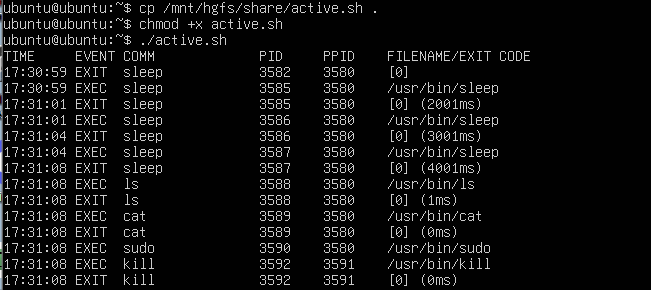
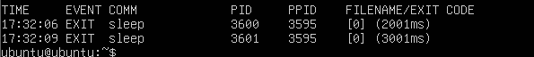

# libbpf를 사용한 유저공간 프로그램: exec() exit() 함수 추적  

### Bootstrap   

이번에 실습할 프로그램은 이눅스 커널에서 발생하는 exec과 exit를 추적하여 프로세스들의 생성과 종료를 관찰하는 것을 목표로 한다.  

커널공간과 우저공간의 역할 분리를 명확히하며 확장이 가능한 구조를 따른다. 사용자 부분은 libbpf 라이브러리를 사용해서 커널공간의 프로그램을 로드하고 실행하며, 커널공간 프로그램에서의 수집한 데이터를 처리하는 구조를 따른다.   


<br>


### 실습 코드  

**커널공간: bootstrap.bpf.c**

```c
// SPDX-License-Identifier: GPL-2.0 OR BSD-3-Clause
/* Copyright (c) 2020 Facebook */
#include "vmlinux.h"
#include <bpf/bpf_helpers.h>
#include <bpf/bpf_tracing.h>
#include <bpf/bpf_core_read.h>
#include "bootstrap.h"

char LICENSE[] SEC("license") = "Dual BSD/GPL";

struct {
    __uint(type, BPF_MAP_TYPE_HASH);
    __uint(max_entries, 8192);
    __type(key, pid_t);
    __type(value, u64);
} exec_start SEC(".maps");

struct {
    __uint(type, BPF_MAP_TYPE_RINGBUF);
    __uint(max_entries, 256 * 1024);
} rb SEC(".maps");

const volatile unsigned long long min_duration_ns = 0;

SEC("tp/sched/sched_process_exec")
int handle_exec(struct trace_event_raw_sched_process_exec *ctx)
{
    struct task_struct *task;
    unsigned fname_off;
    struct event *e;
    pid_t pid;
    u64 ts;

    /* remember time exec() was executed for this PID */
    pid = bpf_get_current_pid_tgid() >> 32;
    ts = bpf_ktime_get_ns();
    bpf_map_update_elem(&exec_start, &pid, &ts, BPF_ANY);

    /* don't emit exec events when minimum duration is specified */
    if (min_duration_ns)
        return 0;

    /* reserve sample from BPF ringbuf */
    e = bpf_ringbuf_reserve(&rb, sizeof(*e), 0);
    if (!e)
        return 0;

    /* fill out the sample with data */
    task = (struct task_struct *)bpf_get_current_task();

    e->exit_event = false;
    e->pid = pid;
    e->ppid = BPF_CORE_READ(task, real_parent, tgid);
    bpf_get_current_comm(&e->comm, sizeof(e->comm));

    fname_off = ctx->__data_loc_filename & 0xFFFF;
    bpf_probe_read_str(&e->filename, sizeof(e->filename), (void *)ctx + fname_off);

    /* successfully submit it to user-space for post-processing */
    bpf_ringbuf_submit(e, 0);
    return 0;
}

SEC("tp/sched/sched_process_exit")
int handle_exit(struct trace_event_raw_sched_process_template* ctx)
{
    struct task_struct *task;
    struct event *e;
    pid_t pid, tid;
    u64 id, ts, *start_ts, duration_ns = 0;

    /* get PID and TID of exiting thread/process */
    id = bpf_get_current_pid_tgid();
    pid = id >> 32;
    tid = (u32)id;

    /* ignore thread exits */
    if (pid != tid)
        return 0;

    /* if we recorded start of the process, calculate lifetime duration */
    start_ts = bpf_map_lookup_elem(&exec_start, &pid);
    if (start_ts)duration_ns = bpf_ktime_get_ns() - *start_ts;
    else if (min_duration_ns)
        return 0;
    bpf_map_delete_elem(&exec_start, &pid);

    /* if process didn't live long enough, return early */
    if (min_duration_ns && duration_ns < min_duration_ns)
        return 0;

    /* reserve sample from BPF ringbuf */
    e = bpf_ringbuf_reserve(&rb, sizeof(*e), 0);
    if (!e)
        return 0;

    /* fill out the sample with data */
    task = (struct task_struct *)bpf_get_current_task();

    e->exit_event = true;
    e->duration_ns = duration_ns;
    e->pid = pid;
    e->ppid = BPF_CORE_READ(task, real_parent, tgid);
    e->exit_code = (BPF_CORE_READ(task, exit_code) >> 8) & 0xff;
    bpf_get_current_comm(&e->comm, sizeof(e->comm));

    /* send data to user-space for post-processing */
    bpf_ringbuf_submit(e, 0);
    return 0;
}
```


### 코드 해석  

```c
struct {
    __uint(type, BPF_MAP_TYPE_HASH);
    __uint(max_entries, 8192);
    __type(key, pid_t);
    __type(value, u64);
} exec_start SEC(".maps");

struct {
    __uint(type, BPF_MAP_TYPE_RINGBUF);
    __uint(max_entries, 256 * 1024);
} rb SEC(".maps");
```

우선 정의된 해시맵과 링버퍼 맵을 확인해본다.  
해시 맵에서는 pid를 key로 사용하고 정수를 value로 사용하는 것을 확인해볼 수 있다.  
실제로 이후 코드에서 이를 활용하여 exit 시점에서 얼마나 오래 살아있었는지 시간을 저장하게 된다.  

아래 링버퍼 맵은 커널에서 유저공간으로 데이터를 전송할 수 있게 해준다.  
다음으로 attach한 지점을 확인해보자.   

<br>

```c
SEC("tp/sched/sched_process_exec")
int handle_exec(struct trace_event_raw_sched_process_exec *ctx)
{
    // ...
    pid = bpf_get_current_pid_tgid() >> 32;
    ts = bpf_ktime_get_ns();
    bpf_map_update_elem(&exec_start, &pid, &ts, BPF_ANY);

    /* don't emit exec events when minimum duration is specified */
    if (min_duration_ns)
        return 0;

    /* reserve sample from BPF ringbuf */
    e = bpf_ringbuf_reserve(&rb, sizeof(*e), 0);
    if (!e)
        return 0;
    // ...

}
```
`tp/sched/sched_process_exec`으로 프로그램을 실행하는 exec 시점에 attach했다.  

코드를 읽어보면 pid와 exec 시작 시간을 알기 위한 ts를 정의한다.  
그리고 해시맵에 이를 저장한다.  

추가로 최소 실행시간 설정을 위한 코드와 링버퍼에 공간을 예약하는 코드가 존재한다.  

<br>


```c
    /* fill out the sample with data */
    task = (struct task_struct *)bpf_get_current_task();

    e->exit_event = false;
    e->pid = pid;
    e->ppid = BPF_CORE_READ(task, real_parent, tgid);
    bpf_get_current_comm(&e->comm, sizeof(e->comm));

    fname_off = ctx->__data_loc_filename & 0xFFFF;
    bpf_probe_read_str(&e->filename, sizeof(e->filename), (void *)ctx + fname_off);

    /* successfully submit it to user-space for post-processing */
    bpf_ringbuf_submit(e, 0);
    return 0;
```

이제 데이터를 써준다.  
exec을 표시하기 위해 `exit_event`는 false이고 pid와 ppid 그리고 명령어 이름과 경로를 알기 위해 `bpf_get_current_comm`와 `bpf_probe_read_str`를 사용했다.  
이후 `bpf_ringbuf_submit(e, 0)`으로 전송.  

<br>

```c
SEC("tp/sched/sched_process_exit")
int handle_exit(struct trace_event_raw_sched_process_template* ctx)
{
    // ...
    /* get PID and TID of exiting thread/process */
    id = bpf_get_current_pid_tgid();
    pid = id >> 32;
    tid = (u32)id;

    /* ignore thread exits */
    if (pid != tid)
        return 0;

    /* if we recorded start of the process, calculate lifetime duration */
    start_ts = bpf_map_lookup_elem(&exec_start, &pid);
    if (start_ts)duration_ns = bpf_ktime_get_ns() - *start_ts;
    else if (min_duration_ns)
        return 0;
    bpf_map_delete_elem(&exec_start, &pid);

    /* if process didn't live long enough, return early */
    if (min_duration_ns && duration_ns < min_duration_ns)
        return 0;
    //...
```

여기선 exit 할 때 호출되도록 `tp/sched/sched_process_exit` 지점에 붙였다.  

프로세스가 종료될 때만을 보기 위해 `pid==tid`일 때만 통과된다.  
다음으로 exec 때 저장한 ts를 통해 duration을 계산해준다.  
최소시간 필터가 적용되었다면 설정된 최소시간보다 짧게 살았다면 반환된다. (버린다.)  

그리고 사용이 끝났다면 `bpf_map_delete_elem(&exec_start, &pid);`를 통해 맵에서 지워준다.  

<br>

```c
    e = bpf_ringbuf_reserve(&rb, sizeof(*e), 0);
    if (!e)
        return 0;

    /* fill out the sample with data */
    task = (struct task_struct *)bpf_get_current_task();

    e->exit_event = true;
    e->duration_ns = duration_ns;
    e->pid = pid;
    e->ppid = BPF_CORE_READ(task, real_parent, tgid);
    e->exit_code = (BPF_CORE_READ(task, exit_code) >> 8) & 0xff;
    bpf_get_current_comm(&e->comm, sizeof(e->comm));

    /* send data to user-space for post-processing */
    bpf_ringbuf_submit(e, 0);
    return 0;
```

이제 exec때와 동일하게 링버퍼를 예약해주고 유저공간으로 넘길 데이터를 예약해준다. 
그리고 `exit_event` 를 포함해서 실행시간인 `duration_ns`와 `pid` `ppid` 종료상태인 `exit_code` 프로세스 이름을 기록해서 전송한다.  


<br>


### 추가 유저 코드  


**유저공간: bootstrap.c**  

```c
// SPDX-License-Identifier: (LGPL-2.1 OR BSD-2-Clause)
/* Copyright (c) 2020 Facebook */
#include <argp.h>
#include <signal.h>
#include <stdio.h>
#include <time.h>
#include <sys/resource.h>
#include <bpf/libbpf.h>
#include "bootstrap.h"
#include "bootstrap.skel.h"

static struct env {
    bool verbose;
    long min_duration_ms;
} env;

const char *argp_program_version = "bootstrap 0.0";
const char *argp_program_bug_address = "<bpf@vger.kernel.org>";
const char argp_program_doc[] =
"BPF bootstrap demo application.\n"
"\n"
"It traces process start and exits and shows associated \n"
"information (filename, process duration, PID and PPID, etc).\n"
"\n"
"USAGE: ./bootstrap [-d <min-duration-ms>] [-v]\n";

static const struct argp_option opts[] = {
    { "verbose", 'v', NULL, 0, "Verbose debug output" },
    { "duration", 'd', "DURATION-MS", 0, "Minimum process duration (ms) to report" },
    {},
};

static error_t parse_arg(int key, char *arg, struct argp_state *state)
{
    switch (key) {
    case 'v':
        env.verbose = true;
        break;
    case 'd':
        errno = 0;
        env.min_duration_ms = strtol(arg, NULL, 10);
    if (errno || env.min_duration_ms <= 0) {
    fprintf(stderr, "Invalid duration: %s\n", arg);
    argp_usage(state);
}
break;
case ARGP_KEY_ARG:
    argp_usage(state);
    break;
default:
    return ARGP_ERR_UNKNOWN;
}
return 0;
}

static const struct argp argp = {
    .options = opts,
    .parser = parse_arg,
    .doc = argp_program_doc,
};

static int libbpf_print_fn(enum libbpf_print_level level, const char *format, va_list args)
{
    if (level == LIBBPF_DEBUG && !env.verbose)
        return 0;
    return vfprintf(stderr, format, args);
}

static volatile bool exiting = false;

static void sig_handler(int sig)
{
    exiting = true;
}

static int handle_event(void *ctx, void *data, size_t data_sz)
{
    const struct event *e = data;
    struct tm *tm;
    char ts[32];
    time_t t;

    time(&t);
    tm = localtime(&t);
    strftime(ts, sizeof(ts), "%H:%M:%S", tm);

    if (e->exit_event) {
        printf("%-8s %-5s %-16s %-7d %-7d [%u]",
               ts, "EXIT", e->comm, e->pid, e->ppid, e->exit_code);
        if (e->duration_ns)
            printf(" (%llums)", e->duration_ns / 1000000);
        printf("\n");
    } else {
        printf("%-8s %-5s %-16s %-7d %-7d %s\n",
               ts, "EXEC", e->comm, e->pid, e->ppid, e->filename);
    }

    return 0;
}

int main(int argc, char **argv)
{
    struct ring_buffer *rb = NULL;
    struct bootstrap_bpf *skel;
    int err;

    /* Parse command line arguments */
    err = argp_parse(&argp, argc, argv, 0, NULL, NULL);
    if (err)
        return err;

    /* Set up libbpf errors and debug info callback */
    libbpf_set_print(libbpf_print_fn);

    /* Cleaner handling of Ctrl-C */
    signal(SIGINT, sig_handler);
    signal(SIGTERM, sig_handler);

    /* Load and verify BPF application */
    skel = bootstrap_bpf__open();
    if (!skel) {
        fprintf(stderr, "Failed to open and load BPF skeleton\n");
        return 1;
    }

    /* Parameterize BPF code with minimum duration parameter */
    skel->rodata->min_duration_ns = env.min_duration_ms * 1000000ULL;

    /* Load & verify BPF programs */
    err = bootstrap_bpf__load(skel);
    if (err) {
        fprintf(stderr, "Failed to load and verify BPF skeleton\n");
        goto cleanup;
    }

    /* Attach tracepoints */
    err = bootstrap_bpf__attach(skel);
    if (err) {
        fprintf(stderr, "Failed to attach BPF skeleton\n");
        goto cleanup;
    }

    /* Set up ring buffer polling */
    rb = ring_buffer__new(bpf_map__fd(skel->maps.rb), handle_event, NULL, NULL);
    if (!rb) {
        err = -1;
        fprintf(stderr, "Failed to create ring buffer\n");
        goto cleanup;
    }

    /* Process events */
    printf("%-8s %-5s %-16s %-7s %-7s %s\n",
        "TIME", "EVENT", "COMM", "PID", "PPID", "FILENAME/EXIT CODE");
    while (!exiting) {
        err = ring_buffer__poll(rb, 100 /* timeout, ms */);
        /* Ctrl-C will cause -EINTR */
        if (err == -EINTR) {
            err = 0;
            break;
        }
        if (err < 0) {
            printf("Error polling perf buffer: %d\n", err);
            break;
        }
    }

cleanup:
    /* Clean up */
    ring_buffer__free(rb);
    bootstrap_bpf__destroy(skel);

    return err < 0 ? -err : 0;
}
```


### 코드 해석   

이 코드는 bpf 코드에서 전달한 데이터를 사용자가 볼 수 있도록 구현하는 코드이다.  

우선 env 구조체를 정의해주었다.  
구조체엔 두가지 값이 있는데 하나는 명령 처리 로그를 보여주는 verbose 모드를 선택할 수 있는 bool 값과 최소 실행시간을 정할 수 있는 min_duration_ms 값이다.  

이후에는 명령어 파싱 코드이다.  
<br>

```c
static int libbpf_print_fn(enum libbpf_print_level level, const char *format, va_list args)
{
    if (level == LIBBPF_DEBUG && !env.verbose)
        return 0;
    return vfprintf(stderr, format, args);
}

static volatile bool exiting = false;

static void sig_handler(int sig)
{
    exiting = true;
}
```

libbpf_print_fn 는 디버그가 필요한 경우에 로그를 출력하는 함수이다.  
sig_handler 은 컨트롤 c 와 같이 프로그램을 중단할 수 있도록 exiting 플래그를 설정해둔 것이다.  
<br>

```c
static int handle_event(void *ctx, void *data, size_t data_sz)
{
    const struct event *e = data;
    struct tm *tm;
    char ts[32];
    time_t t;

    time(&t);
    tm = localtime(&t);
    strftime(ts, sizeof(ts), "%H:%M:%S", tm);

    if (e->exit_event) {
        printf("%-8s %-5s %-16s %-7d %-7d [%u]",
               ts, "EXIT", e->comm, e->pid, e->ppid, e->exit_code);
        if (e->duration_ns)
            printf(" (%llums)", e->duration_ns / 1000000);
        printf("\n");
    } else {
        printf("%-8s %-5s %-16s %-7d %-7d %s\n",
               ts, "EXEC", e->comm, e->pid, e->ppid, e->filename);
    }

    return 0;
}
```

handle_event 함수는 BPF 코드에서 전달했던 데이터이다.  
전달했던 데이터를 event 구조체로 해석하여 같은 형태의 데이터를 공유하는 셈이 된다.  
이후 이벤트 발생 시점의 시간을 계산하여 exit 일때, 실행시간을 기록한 경우일 때, exec일 때를 구분해서 조금씩 다른 형태로 출력한다.  
<br>

다음으로 메인 함수 로직은 주석으로 잘 설명이 되어있다.  
주요 기능은 아래와 같다.  

- 명령어 줄 인자 파싱 
- libbpf 오류와 디버그 정보 출력을 위해 콜백 설정
- BPF 코드 로드와 검증
- 최소실행시간 파라미터를 BPF 코드에 전달
- tracepoint에 BPF 프로그램을 부착
- ring buffer 폴링 설정
- 프로그램 종료, 리소스 정리

<br>


### 코드 실행  


**eBPF 오브젝트 파일 생성**   

eBPF 코드를 바이트코드로 컴파일해주고  

```bash
clang -target bpf -g -c bootstrap.bpf.c -o bootstrap.bpf.o
```

만든 .o 파일로 스켈레톤 헤더파일을 만들어준 뒤  

```bash
bpftool gen skeleton bootstrap.bpf.o > bootstrap.skel.h
```

유저공간 코드를 컴파일하여 실행 파일을 생성해준다.  

```bash
clang bootstrap.c -o bootstrap -lbpf -lelf -lz
```

그리고 로그를 띄울 임의의 sh 코드를 만들어줬다.   

```sh
#!/usr/bin/env bash

sudo ./bootstrap &
BOOT_PID=$!

sleep 1
sleep 2
sleep 3

ls / > /dev/null 2>&1
cat /etc/passwd > /dev/null 2>&1

sudo kill -INT "$BOOT_PID"
wait "$BOOT_PID"
```

<br>


그리고 이걸 실행해보면,  

```bash
sudo ./bootstrap
```

   
이렇게 모든 정보가 잘 출력이 되는 것을 볼 수 있다.  
추가로 

sudo ./bootstrap -d 150 인 최소시간을 설정하면,   
<br>

  
이렇게 실행시간이 1.5초 이상인 sleep만 출력할 수 있다.  


<br>
<br>

## References  

- Full practice sequence : https://github.com/eunomia-bpf/bpf-developer-tutorial/tree/main/src/11-bootstrap

- Compile and Run : https://github.com/eunomia-bpf/eunomia-bpf/tree/master/examples/bpftools/bootstrap