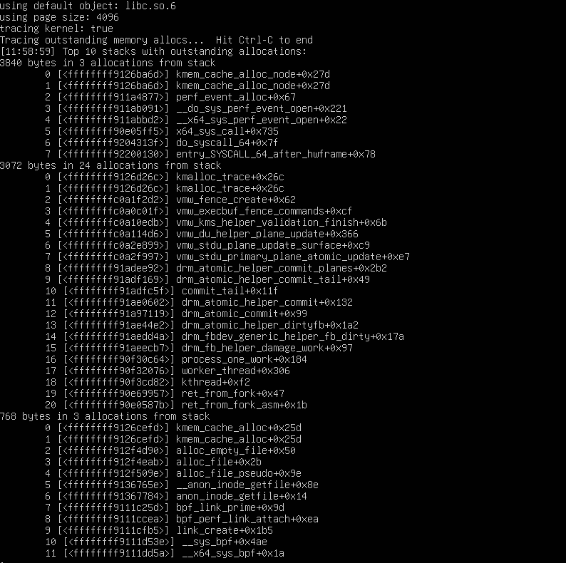
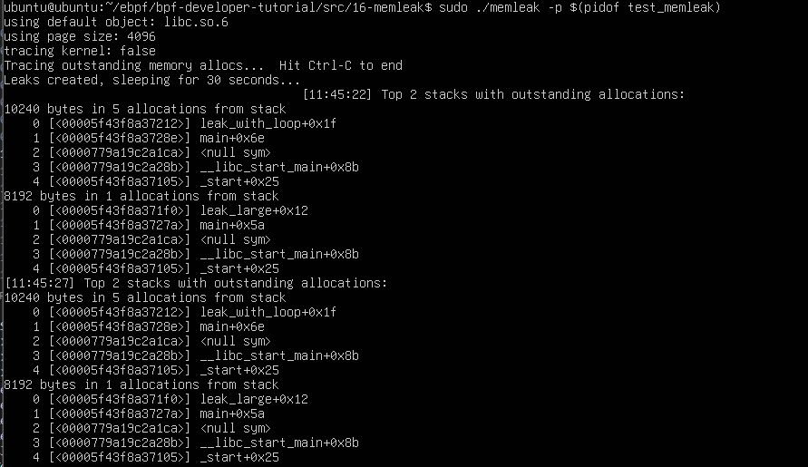

# 메모리누수 모니터링

### 메모리 누수  
메모리 누수는 컴퓨터 프로그래밍에서 자주 나오는 문제이다.  
메모리 누수가 발생하게 되면 시간이 지나면서 시스템의 가용 메모리를 점진적으로 소비하게 되고, 이러한 현상은 시스템 전반의 성능을 저하시킨다.  

메모리 누수의 원인은 다양한데, 대표적인 원인은 아래와 같다.  
- 동적 메모리 할당 및 해제 과정에서의 구성 오류
- 소프트웨어의 버그, 메모리 관리 전략 오류

예를 들어 더 이상 사용하지 않는 메모리를 해제하지 않게되면 메모리 누수가 발생한다. 추가로 메모리 사용량이 급격하게 증가하면 페이징과 스와핑이 빈번하게 발생하야 시스템 성능이 저하된다.  

<br>

### 메모리 누수 디버깅의 어려움  

메모리 누수 문제를 디버깅하는 과정은 굉장히 복잡하고 난이도가 높다.  
원인파악을 위해 프로그램의 구조뿐만 아니라 메모히 할당과 해제 흐름을 세밀하게 분리해야 한다. 이 과정에서 특수 진단 도구가 사용된다.  

malloc()과 같은 메모리 할당 함수를 추적하여 모든 메모리 접근을 검사하는 방식은 어플리케이션의 실행 속도가 크게 저하된다. 또한 heap 분석 도구를 사용하는 방법도 실행 속도가 저하된다. 또한 gdb 같은 디버거를 통해 메모리 사용 상태를 사후 분석하는 방법도 있는데 이 방식은 정확도가 굉장히 높다. 그러나 실시간 환경이나 운영 중인 시스템에서는 적용이 어렵다는 단점이 있다.  

<br>

### eBPF를 통한 메모리 누수 디버깅  
이러한 맥락에서 ebpf는 효율적으로 메모리를 할당 및 해제를 포함하여 시스템 수준의 이벤트를 모니터링하고 추적할 수 있다는 것이 중요한 포인트다.  
ebpf를 사용하여 실시간으로 메모리 할당과 해제 요청을 추적할 수 있으며, 각 메모리 할당에 대한 호출 스택을 함께 수집할 수 있다.  

이 접근 방식의 가장 큰 장점은 실행 중인 어플리케이션 대상으로 내부에서 실시간 분석이 가능하는 점이다.  

<br>

### ebpf 기반 memleak 도구   
이번 실습에서 다루게 될 memleak 도구는 메모리 할당 요청과 할당 해제 요청을 추적하고 연관시킨다. 또한 각 메모리 할당에 대한 호출 스택을 수집하여 할당은 수행되었으나 해제되지 않은 호출 스택을 출력한다. 
 
```console
# ./memleak -p $(pidof allocs)
Attaching to pid 5193, Ctrl+C to quit.
[11:16:33] Top 2 stacks with outstanding allocations:
        80 bytes in 5 allocations from stack
                 main+0x6d [allocs]
                 __libc_start_main+0xf0 [libc-2.21.so]

[11:16:34] Top 2 stacks with outstanding allocations:
        160 bytes in 10 allocations from stack
                 main+0x6d [allocs]
                 __libc_start_main+0xf0 [libc-2.21.so]
```

이 명령을 실행하면 할당되었지만 아직 해제되지 않은 메모리가 어떤 호출 스택에서 발생했는지 확인할 수 있다. 또한 해당 미해제 메모리 블록의 크기와 개수를 함께 확인할 수 있다.

출력 결과를 통해 allocs 프로세스의 main 함수가 시간에 따라 16바이트 단위로 메모리를 지속적으로 누출하고 있음을 확인할 수 있다. 이 과정에서 각 개별 할당을 하나씩 분석할 필요는 없다. memleak 도구가 메모리 누수가 집중적으로 발생하는 호출 스택을 요약 정보 형태로 제공하기 때문이다.


<br>

### memleak의 구현 원칙  
메모리 해제 함수가 호출되면 memleak은 내부 맵에서 해당 메모리 할당 기록을 제거한다. 이 메커니즘을 통해 할당되었으나 해제되지 않은 메모리 블록을 정확하게 추적할 수 있다.

사용자 공간에서 자주 사용되는 메모리 할당 함수(예: malloc, calloc)의 경우, memleak은 사용자 공간 uprobe를 사용하여 모니터링한다.  

<br>

### 커널 공간 메모리 할당 추적

커널 모드 eBPF 런타임에서 uprobe를 사용하는 경우 상대적으로 큰 성능 오버헤드가 발생할 수 있다. 이러한 상황에서는 bpftime과 같은 사용자 모드 eBPF 런타임을 사용한다. 사용자 모드에서 eBPF 프로그램을 실행할 수 있어서 기존 커널 모드 eBPF와도 호환성이 좋다.  

커널 공간에서 발생하는 메모리 할당 함수(kmalloc)를 추적하기 위해 memleak은 tracepoint를 활용한다. 이러한 트레이스포인트 기반 접근 방식을 통해 커널 공간에서 발생하는 메모리 누수 또한 효율적으로 감지할 수 있다.

<br>

### 커널공간 ebpf 프로그램 구현  
이번 실습에서는 제공하는 파일이 많으므로 파일의 구조부터 먼저 파악하고 가보자.  

커널공간 코드
- memleak.bpf.c
- maps.bpf.h
- core_fixes.bpf.h

유저공간 코드
- memleak.c
- trace_helpers.c
- trace_helpers.h

공용 헤더파일
- memleak.h

테스트 코드
- test_memleak.c


전체 코드는 아래에서 다운 받을 수 있다.  
https://github.com/eunomia-bpf/bpf-developer-tutorial/tree/main/src/16-memleak


**memleak.bpf.c**  

```c
// SPDX-License-Identifier: GPL-2.0
// Copyright (c) 2023 Meta Platforms, Inc. and affiliates.
#include <vmlinux.h>
#include <bpf/bpf_helpers.h>
#include <bpf/bpf_tracing.h>

#include "maps.bpf.h"
#include "memleak.h"
#include "core_fixes.bpf.h"

const volatile size_t min_size = 0;
const volatile size_t max_size = -1;
const volatile size_t page_size = 4096;
const volatile __u64 sample_rate = 1;
const volatile bool trace_all = false;
const volatile __u64 stack_flags = 0;
const volatile bool wa_missing_free = false;

struct {
	__uint(type, BPF_MAP_TYPE_HASH);
	__type(key, pid_t);
	__type(value, u64);
	__uint(max_entries, 10240);
} sizes SEC(".maps");

struct {
	__uint(type, BPF_MAP_TYPE_HASH);
	__type(key, u64); /* address */
	__type(value, struct alloc_info);
	__uint(max_entries, ALLOCS_MAX_ENTRIES);
} allocs SEC(".maps");

struct {
	__uint(type, BPF_MAP_TYPE_HASH);
	__type(key, u64); /* stack id */
	__type(value, union combined_alloc_info);
	__uint(max_entries, COMBINED_ALLOCS_MAX_ENTRIES);
} combined_allocs SEC(".maps");

struct {
	__uint(type, BPF_MAP_TYPE_HASH);
	__type(key, u64);
	__type(value, u64);
	__uint(max_entries, 10240);
} memptrs SEC(".maps");

struct {
	__uint(type, BPF_MAP_TYPE_STACK_TRACE);
	__type(key, u32);
} stack_traces SEC(".maps");

static union combined_alloc_info initial_cinfo;

static void update_statistics_add(u64 stack_id, u64 sz)
{
	union combined_alloc_info *existing_cinfo;

	existing_cinfo = bpf_map_lookup_or_try_init(&combined_allocs, &stack_id, &initial_cinfo);
	if (!existing_cinfo)
		return;

	const union combined_alloc_info incremental_cinfo = {
		.total_size = sz,
		.number_of_allocs = 1
	};

	__sync_fetch_and_add(&existing_cinfo->bits, incremental_cinfo.bits);
}

static void update_statistics_del(u64 stack_id, u64 sz)
{
	union combined_alloc_info *existing_cinfo;

	existing_cinfo = bpf_map_lookup_elem(&combined_allocs, &stack_id);
	if (!existing_cinfo) {
		bpf_printk("failed to lookup combined allocs\n");

		return;
	}

	const union combined_alloc_info decremental_cinfo = {
		.total_size = sz,
		.number_of_allocs = 1
	};

	__sync_fetch_and_sub(&existing_cinfo->bits, decremental_cinfo.bits);
}

static int gen_alloc_enter(size_t size)
{
	if (size < min_size || size > max_size)
		return 0;

	if (sample_rate > 1) {
		if (bpf_ktime_get_ns() % sample_rate != 0)
			return 0;
	}

	const pid_t pid = bpf_get_current_pid_tgid() >> 32;
	bpf_map_update_elem(&sizes, &pid, &size, BPF_ANY);

	if (trace_all)
		bpf_printk("alloc entered, size = %lu\n", size);

	return 0;
}

static int gen_alloc_exit2(void *ctx, u64 address)
{
	const pid_t pid = bpf_get_current_pid_tgid() >> 32;
	struct alloc_info info;

	const u64* size = bpf_map_lookup_elem(&sizes, &pid);
	if (!size)
		return 0; // missed alloc entry

	__builtin_memset(&info, 0, sizeof(info));

	info.size = *size;
	bpf_map_delete_elem(&sizes, &pid);

	if (address != 0) {
		info.timestamp_ns = bpf_ktime_get_ns();

		info.stack_id = bpf_get_stackid(ctx, &stack_traces, stack_flags);

		bpf_map_update_elem(&allocs, &address, &info, BPF_ANY);

		update_statistics_add(info.stack_id, info.size);
	}

	if (trace_all) {
		bpf_printk("alloc exited, size = %lu, result = %lx\n",
				info.size, address);
	}

	return 0;
}

static int gen_alloc_exit(struct pt_regs *ctx)
{
	return gen_alloc_exit2(ctx, PT_REGS_RC(ctx));
}

static int gen_free_enter(const void *address)
{
	const u64 addr = (u64)address;

	const struct alloc_info *info = bpf_map_lookup_elem(&allocs, &addr);
	if (!info)
		return 0;

	bpf_map_delete_elem(&allocs, &addr);
	update_statistics_del(info->stack_id, info->size);

	if (trace_all) {
		bpf_printk("free entered, address = %lx, size = %lu\n",
				address, info->size);
	}

	return 0;
}

SEC("uprobe")
int BPF_KPROBE(malloc_enter, size_t size)
{
	return gen_alloc_enter(size);
}

SEC("uretprobe")
int BPF_KRETPROBE(malloc_exit)
{
	return gen_alloc_exit(ctx);
}

SEC("uprobe")
int BPF_KPROBE(free_enter, void *address)
{
	return gen_free_enter(address);
}

SEC("uprobe")
int BPF_KPROBE(calloc_enter, size_t nmemb, size_t size)
{
	return gen_alloc_enter(nmemb * size);
}

SEC("uretprobe")
int BPF_KRETPROBE(calloc_exit)
{
	return gen_alloc_exit(ctx);
}

SEC("uprobe")
int BPF_KPROBE(realloc_enter, void *ptr, size_t size)
{
	gen_free_enter(ptr);

	return gen_alloc_enter(size);
}

SEC("uretprobe")
int BPF_KRETPROBE(realloc_exit)
{
	return gen_alloc_exit(ctx);
}

SEC("uprobe")
int BPF_KPROBE(mmap_enter, void *address, size_t size)
{
	return gen_alloc_enter(size);
}

SEC("uretprobe")
int BPF_KRETPROBE(mmap_exit)
{
	return gen_alloc_exit(ctx);
}

SEC("uprobe")
int BPF_KPROBE(munmap_enter, void *address)
{
	return gen_free_enter(address);
}

SEC("uprobe")
int BPF_KPROBE(posix_memalign_enter, void **memptr, size_t alignment, size_t size)
{
	const u64 memptr64 = (u64)(size_t)memptr;
	const u64 pid = bpf_get_current_pid_tgid() >> 32;
	bpf_map_update_elem(&memptrs, &pid, &memptr64, BPF_ANY);

	return gen_alloc_enter(size);
}

SEC("uretprobe")
int BPF_KRETPROBE(posix_memalign_exit)
{
	const u64 pid = bpf_get_current_pid_tgid() >> 32;
	u64 *memptr64;
	void *addr;

	memptr64 = bpf_map_lookup_elem(&memptrs, &pid);
	if (!memptr64)
		return 0;

	bpf_map_delete_elem(&memptrs, &pid);

	if (bpf_probe_read_user(&addr, sizeof(void*), (void*)(size_t)*memptr64))
		return 0;

	const u64 addr64 = (u64)(size_t)addr;

	return gen_alloc_exit2(ctx, addr64);
}

SEC("uprobe")
int BPF_KPROBE(aligned_alloc_enter, size_t alignment, size_t size)
{
	return gen_alloc_enter(size);
}

SEC("uretprobe")
int BPF_KRETPROBE(aligned_alloc_exit)
{
	return gen_alloc_exit(ctx);
}

SEC("uprobe")
int BPF_KPROBE(valloc_enter, size_t size)
{
	return gen_alloc_enter(size);
}

SEC("uretprobe")
int BPF_KRETPROBE(valloc_exit)
{
	return gen_alloc_exit(ctx);
}

SEC("uprobe")
int BPF_KPROBE(memalign_enter, size_t alignment, size_t size)
{
	return gen_alloc_enter(size);
}

SEC("uretprobe")
int BPF_KRETPROBE(memalign_exit)
{
	return gen_alloc_exit(ctx);
}

SEC("uprobe")
int BPF_KPROBE(pvalloc_enter, size_t size)
{
	return gen_alloc_enter(size);
}

SEC("uretprobe")
int BPF_KRETPROBE(pvalloc_exit)
{
	return gen_alloc_exit(ctx);
}

/**
 * commit 11e9734bcb6a("mm/slab_common: unify NUMA and UMA version of
 * tracepoints") drops kmem_alloc event class, rename kmem_alloc_node to
 * kmem_alloc, so `trace_event_raw_kmem_alloc_node` is not existed any more.
 * see:
 *    https://github.com/torvalds/linux/commit/11e9734bcb6a
 */
struct trace_event_raw_kmem_alloc_node___x {
	const void *ptr;
	size_t bytes_alloc;
} __attribute__((preserve_access_index));

static __always_inline bool has_kmem_alloc_node(void)
{
	if (bpf_core_type_exists(struct trace_event_raw_kmem_alloc_node___x))
		return true;
	return false;
}


/**
 * commit 2c1d697fb8ba("mm/slab_common: drop kmem_alloc & avoid dereferencing
 * fields when not using") drops kmem_alloc event class. As a result,
 * `trace_event_raw_kmem_alloc` is removed, `trace_event_raw_kmalloc` and
 * `trace_event_raw_kmem_cache_alloc` are added.
 * see:
 *    https://github.com/torvalds/linux/commit/2c1d697fb8ba
 */
struct trace_event_raw_kmem_alloc___x {
	const void *ptr;
	size_t bytes_alloc;
} __attribute__((preserve_access_index));

struct trace_event_raw_kmalloc___x {
	const void *ptr;
	size_t bytes_alloc;
} __attribute__((preserve_access_index));

struct trace_event_raw_kmem_cache_alloc___x {
	const void *ptr;
	size_t bytes_alloc;
} __attribute__((preserve_access_index));

static __always_inline bool has_kmem_alloc(void)
{
	if (bpf_core_type_exists(struct trace_event_raw_kmem_alloc___x))
		return true;
	return false;
}

SEC("tracepoint/kmem/kmalloc")
int memleak__kmalloc(void *ctx)
{
	const void *ptr;
	size_t bytes_alloc;

	if (has_kmem_alloc()) {
		struct trace_event_raw_kmem_alloc___x *args = ctx;
		ptr = BPF_CORE_READ(args, ptr);
		bytes_alloc = BPF_CORE_READ(args, bytes_alloc);
	} else {
		struct trace_event_raw_kmalloc___x *args = ctx;
		ptr = BPF_CORE_READ(args, ptr);
		bytes_alloc = BPF_CORE_READ(args, bytes_alloc);
	}

	if (wa_missing_free)
		gen_free_enter(ptr);

	gen_alloc_enter(bytes_alloc);

	return gen_alloc_exit2(ctx, (u64)ptr);
}

SEC("tracepoint/kmem/kmalloc_node")
int memleak__kmalloc_node(void *ctx)
{
	const void *ptr;
	size_t bytes_alloc;

	if (has_kmem_alloc_node()) {
		struct trace_event_raw_kmem_alloc_node___x *args = ctx;
		ptr = BPF_CORE_READ(args, ptr);
		bytes_alloc = BPF_CORE_READ(args, bytes_alloc);

		if (wa_missing_free)
			gen_free_enter(ptr);

		gen_alloc_enter( bytes_alloc);

		return gen_alloc_exit2(ctx, (u64)ptr);
	} else {
		/* tracepoint is disabled if not exist, avoid compile warning */
		return 0;
	}
}

SEC("tracepoint/kmem/kfree")
int memleak__kfree(void *ctx)
{
	const void *ptr;

	if (has_kfree()) {
		struct trace_event_raw_kfree___x *args = ctx;
		ptr = BPF_CORE_READ(args, ptr);
	} else {
		struct trace_event_raw_kmem_free___x *args = ctx;
		ptr = BPF_CORE_READ(args, ptr);
	}

	return gen_free_enter(ptr);
}

SEC("tracepoint/kmem/kmem_cache_alloc")
int memleak__kmem_cache_alloc(void *ctx)
{
	const void *ptr;
	size_t bytes_alloc;

	if (has_kmem_alloc()) {
		struct trace_event_raw_kmem_alloc___x *args = ctx;
		ptr = BPF_CORE_READ(args, ptr);
		bytes_alloc = BPF_CORE_READ(args, bytes_alloc);
	} else {
		struct trace_event_raw_kmem_cache_alloc___x *args = ctx;
		ptr = BPF_CORE_READ(args, ptr);
		bytes_alloc = BPF_CORE_READ(args, bytes_alloc);
	}

	if (wa_missing_free)
		gen_free_enter(ptr);

	gen_alloc_enter(bytes_alloc);

	return gen_alloc_exit2(ctx, (u64)ptr);
}

SEC("tracepoint/kmem/kmem_cache_alloc_node")
int memleak__kmem_cache_alloc_node(void *ctx)
{
	const void *ptr;
	size_t bytes_alloc;

	if (has_kmem_alloc_node()) {
		struct trace_event_raw_kmem_alloc_node___x *args = ctx;
		ptr = BPF_CORE_READ(args, ptr);
		bytes_alloc = BPF_CORE_READ(args, bytes_alloc);

		if (wa_missing_free)
			gen_free_enter(ptr);

		gen_alloc_enter(bytes_alloc);

		return gen_alloc_exit2(ctx, (u64)ptr);
	} else {
		/* tracepoint is disabled if not exist, avoid compile warning */
		return 0;
	}
}

SEC("tracepoint/kmem/kmem_cache_free")
int memleak__kmem_cache_free(void *ctx)
{
	const void *ptr;

	if (has_kmem_cache_free()) {
		struct trace_event_raw_kmem_cache_free___x *args = ctx;
		ptr = BPF_CORE_READ(args, ptr);
	} else {
		struct trace_event_raw_kmem_free___x *args = ctx;
		ptr = BPF_CORE_READ(args, ptr);
	}

	return gen_free_enter(ptr);
}

SEC("tracepoint/kmem/mm_page_alloc")
int memleak__mm_page_alloc(struct trace_event_raw_mm_page_alloc *ctx)
{
	gen_alloc_enter(page_size << ctx->order);

	return gen_alloc_exit2(ctx, ctx->pfn);
}

SEC("tracepoint/kmem/mm_page_free")
int memleak__mm_page_free(struct trace_event_raw_mm_page_free *ctx)
{
	return gen_free_enter((void *)ctx->pfn);
}

SEC("tracepoint/percpu/percpu_alloc_percpu")
int memleak__percpu_alloc_percpu(struct trace_event_raw_percpu_alloc_percpu *ctx)
{
	gen_alloc_enter(ctx->bytes_alloc);

	return gen_alloc_exit2(ctx, (u64)(ctx->ptr));
}

SEC("tracepoint/percpu/percpu_free_percpu")
int memleak__percpu_free_percpu(struct trace_event_raw_percpu_free_percpu *ctx)
{
	return gen_free_enter(ctx->ptr);
}

char LICENSE[] SEC("license") = "GPL";
```

**memleak.h**
```c
#ifndef __MEMLEAK_H
#define __MEMLEAK_H

#define ALLOCS_MAX_ENTRIES 1000000
#define COMBINED_ALLOCS_MAX_ENTRIES 10240

struct alloc_info {
	__u64 size;
	__u64 timestamp_ns;
	int stack_id;
};

union combined_alloc_info {
	struct {
		__u64 total_size : 40;
		__u64 number_of_allocs : 24;
	};
	__u64 bits;
};

#endif /* __MEMLEAK_H */
```

우선 map들 부터 확인을 해봤다.  
sizes, allocs, combined_allocs, memptrs, stack_traces 이렇게 네가지가 있다.  

이 프로그램은 메모리 할당을 기록하고, free를 삭제하여 집계하는 식으로 동작한다.  
그래서 이렇게 5가지 역할을 나눈 MAP을 사용한다.  

우선 sizes 맵은 pid를 키값으로 사용하는 해시맵으로 alloc의 진입 시점에 얻은 사이즈를 반환하는 시점까지 임시로 저장하는 곳이다. 이런 맵이 있는 이유는 uprobes에서 진입 시점에 사이즈를 확실하게 알 수 있고 반환시점에 포인터를 알 수 있기 때문에 미리 저장해두는 것이다.  

allocs 맵은 할당된 포인터 주소를 키값으로 가지는 맵이다. value로는 struct alloc_info를 가지게 되는데 이것은 memleak 헤더파일에 정의된 구조체이다. 이 구조체는 주소 하나에 대한 메타데이터이다. size와 할당시간인 타임스탬프와 stack trace id를 기록한다. 지금까지 할당이 되었지만 free가 되지 안ㄹ은 블록을 주소 기준으로 추적하기 위해 필요한 맵이다.  

combined_allocs 맵은 스택 id를 키값으로 가진다. value로 가지는 값은 union combined_alloc_info으로 이것도 memleak 헤더파일에 정의된 구조체이다. 이 유니온은 스택 단위로 집계를 하기 위한 구조체이다. 총 사이즈와 아직 해제되지 않은 alloc의 수를 가진다. 목적은 allocs 맵만 쓰면 할당을 분석할 때 마다 전체 순회를 해야해서 비용이 크기 때문에 스택별로 값을 미리 저장해둠으로 효율을 높이기 위해서이다.  

memptrs 맵은 pid를 키값으로, 사용자 메모리 주소를 value로 가지는 맵이다. 목적은 uretprobe에서 특정 함수는, 할당된 포인터를 리턴값으로 주지않고 사용자가 넘긴 memptr이 가리키는 메모리 위치에 포인터로 전달하기 때문에 이를 처리하기 위해 임시 저장소 역할을 하는 맵이다.  

stack_traces 맵은 BPF_MAP_TYPE_STACK_TRACE 타입으로 stack trace 자체를 저장하는 맵이다. 프로그램은 메모리 할당 시점에 bpf_get_stackid(ctx, &stack_traces, stack_flags)를 통해 스택을 수집하게 된다. 이때 실제 스택 프레임은 stack_traces 맵에 저장되고, 함수는 식별자인 stack_id 를 반환한다. 이후 allocs에 주소별로 stack_id를 저장하고 combined_allocs 맵에서는 그 값을 키로 저장한다. 요약하자만 이 맵은 누수가 발생한 시점의 호출 경로를 저장하는 것이다.  

<br>

이후 attach 지점을 보면 크게 두가지로 나뉜다.  
- `SEC("uprobe")` or `SEC("uretprobe")` : 사용자 공간 함수 후킹
- `SEC("tracepoint/...")` : 커널 tracepoint 이벤트 후킹

이렇게 나눈 이유는 메모리 할당이 발생이 유저공간과 커널공간으로 나뉘고 추적 방식이 다르기 때문이다.  

uprobe는 따로 파일 수정없이 실행중에 특정 함수의 진입과 반환지점에서 동적으로 후킹이 가능하기 때문에 어플리케이션의 메모리 할당과 해제를 관찰이 가능하다.  

하지만 커널 내부에서는 메모리 할당이 `kmalloc`, `kfree`, `kmem_cache_alloc`, 페이지 할당과 같이 수행되기 때문에 uprobe는 추적이 안되고 tp를 통해 후킹해야만한다. 그래서 tp를 활용하여 커널 내부의 동작을 안정적으로 관측할 수 있는 것이다.  


### 실행  

이번 memleak 실습은 몇개의 소스 파일만으로 구성된 프로그램이 아니라, 여러 ebpf 도구와 라이브러리에 강하게 의존하는 예제이다.   
따라서 서브모듈로 제공되는 여러 라이브러리와 디렉토리 구조가 Makefile에 제공되어 있다. 따라서 개별 파일을 분리하고 서브모듈을 설치하기보단 제공된 빌드 방식을 따랐다.  

```
git clone https://github.com/eunomia-bpf/bpf-developer-tutorial.git
cd bpf-developer-tutorial
git submodule update --init --recursive

cd src/16-memleak
make
```


### 실행 결과  
  


```
$ make
$ sudo ./memleak | less

using default object: libc.so.6
using page size: 4096
tracing kernel: true
Tracing outstanding memory allocs...  Hit Ctrl-C to end
[11:58:59] Top 10 stacks with outstanding allocations:
3840 bytes in 3 allocations from stack
    0 [<ffffffff9126ba6d>] kmem_cache_alloc_node+0x27d
    1 [<ffffffff9126ba6d>] kmem_cache_alloc_node+0x27d
    2 [<ffffffff911a4877>] perf_event_alloc+0x67
    3 [<ffffffff911ab091>] __do_sys_perf_event_open+0x221
    4 [<ffffffff911abbd2>] __x64_sys_perf_event_open+0x22
    5 [<ffffffff90e05ff5>] x64_sys_call+0x735
    6 [<ffffffff9204313f>] do_syscall_64+0x7f
    7 [<ffffffff92200130>] entry_SYSCALL_64_after_hwframe+0x78

3072 bytes in 24 allocations from stack
    0 [<ffffffff9126d26c>] kmalloc_trace+0x26c
    1 [<ffffffff9126d26c>] kmalloc_trace+0x26c
    2 [<ffffffffc0a1f2d2>] vmu_fence_create+0x62
    3 [<ffffffffc0a0c01f>] vmu_execbuf_fence_commands+0xcf
    4 [<ffffffffc0a10edb>] vmu_kms_helper_validate_ioctl_finish+0x6b
    5 [<ffffffffc0a114d6>] vmu_du_helper_plane_update+0x366
    6 [<ffffffffc0a2e899>] vmu_stdu_plane_update_surface+0x9c9
    7 [<ffffffffc0a2f997>] vmu_stdu_primary_plane_atomic_update+0xe7
    8 [<ffffffff91adee92>] drm_atomic_helper_commit+0x2b2
    9 [<ffffffff91adf169>] drm_atomic_helper_commit_tail+0x49
   10 [<ffffffff91adfc5f>] commit_tail+0x11
   11 [<ffffffff91ae0602>] drm_atomic_helper_commit+0x132
   12 [<ffffffff91a97119>] drm_atomic_commit+0x99
   13 [<ffffffff91ae44e2>] drm_atomic_helper_dirtyfb+0x1a2
   14 [<ffffffff91aedd4a>] drm_fbdev_generic_helper_fb_dirty+0x17a
   15 [<ffffffff91aeecb7>] drm_fb_helper_damage_work+0x97
   16 [<ffffffff90f30c64>] process_one_work+0x184
   17 [<ffffffff90f32076>] worker_thread+0x306
   18 [<ffffffff90f3cd82>] kthread+0xf2
   19 [<ffffffff90e69957>] ret_from_fork+0x47
   20 [<ffffffff90e0587b>] ret_from_fork_asm+0x1b

768 bytes in 3 allocations from stack
    0 [<ffffffff9126cefd>] kmem_cache_alloc+0x25d
    1 [<ffffffff9126cefd>] kmem_cache_alloc+0x25d
    2 [<ffffffff912f4d90>] alloc_empty_file+0x50
    3 [<ffffffff912f4eab>] alloc_file+0x2b
    4 [<ffffffff912f509e>] alloc_file_pseudo+0x9e
    5 [<ffffffff9136765e>] __anon_inode_getfile+0x8e
    6 [<ffffffff91367784>] anon_inode_getfile+0x14
    7 [<ffffffff911c25d4>] bpf_link_prime+0x9d
    8 [<ffffffff911ccea>] bpf_perf_link_attach+0xea
    9 [<ffffffff911cfb5>] link_create+0x1b5
   10 [<ffffffff911d53e>] __sys_bpf+0x4ae
   11 [<ffffffff911dd5a>] __x64_sys_bpf+0x1a

..(생략)..

```

한번에 많은 옵션이 나와 less로 한 화면으로 관측했다.  

tracing kernel: true로 커널 메모리 할당을 추적한 결과이다.  
출력에 보이는 스택들이 `kmalloc_trace`, `kmem_cache_alloc`, `perf_event_open`, 등 메모리 할당과 성능 모니터링에 사용되는 tracepoint/함수/syscall 이다.  

즉 현재 시점에서 free되지 않은 커널 할당이 어떤 스택에서 발생했는지 알려주는 로그이다.  


<br>


  

```console
$ make test_memleak
$ ./test_memleak &
$ sudo ./memleak -p $(pidof test_memleak)
using default object: libc.so.6
using page size: 4096
tracing kernel: false
Tracing outstanding memory allocs...  Hit Ctrl-C to end
Leaks created, sleeping for 30 seconds...
[11:45:22] Top 2 stacks with outstanding allocations:

10240 bytes in 5 allocations from stack
    0 [<00005f43f8a37212>] leak_with_loop+0x1f
    1 [<00005f43f8a3728e>] main+0x6e
    2 [<0000779a19c2a1ca>] <null sym>
    3 [<0000779a19c2a28b>] __libc_start_main+0x8b
    4 [<00005f43f8a37105>] _start+0x25

8192 bytes in 1 allocations from stack
    0 [<00005f43f8a371f0>] leak_large+0x12
    1 [<00005f43f8a3727a>] main+0x5a
    2 [<0000779a19c2a1ca>] <null sym>
    3 [<0000779a19c2a28b>] __libc_start_main+0x8b
    4 [<00005f43f8a37105>] _start+0x25

[11:45:27] Top 2 stacks with outstanding allocations:

10240 bytes in 5 allocations from stack
    0 [<00005f43f8a37212>] leak_with_loop+0x1f
    1 [<00005f43f8a3728e>] main+0x6e
    2 [<0000779a19c2a1ca>] <null sym>
    3 [<0000779a19c2a28b>] __libc_start_main+0x8b
    4 [<00005f43f8a37105>] _start+0x25

8192 bytes in 1 allocations from stack
    0 [<00005f43f8a371f0>] leak_large+0x12
    1 [<00005f43f8a3727a>] main+0x5a
    2 [<0000779a19c2a1ca>] <null sym>
    3 [<0000779a19c2a28b>] __libc_start_main+0x8b
    4 [<00005f43f8a37105>] _start+0x25

..(생략)..


```

그리고 이렇게 memleak을 일으키는 테스트 코드를 사용하여 leak_with_loop()와 leak_large()에서 발생하는 지속적인 메모리 누수를 자세하게 관측할 수 있다.  


<br>
<br>

## References  

- Full practice sequence : https://github.com/eunomia-bpf/bpf-developer-tutorial/blob/main/src/16-memleak/README.md
