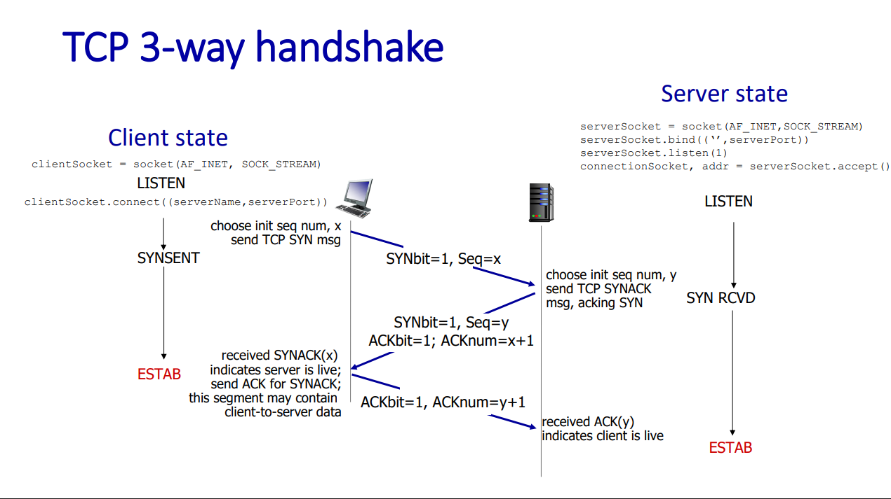
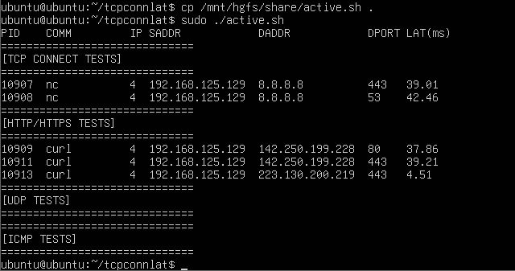

# TCP 연결 지연 확인  

### TCP 연결 지연  
개발을 할 때 데이터베이스를 호출하거나, 원격 호출을 수행하는 경우가 종종 나타난다. 이럴 때 구현은 보통 TCP 프로토콜을 기반으로 한다. 이는 안정적인 연결과 오류가 일어날 때 재전송, 혼잡 제어 등의 장점을 가지고 있기 때문이다. 하지만 TCP는 이러한 장점을 가지지만 UDP 보다 연결 지연이 크다는 단점이 있다. TCP 연결 지연을 분석하면 네트워크의 성능 분석과 문제 해결에 유용하다.   

<br>

### tcpconnlat  

tcpconnlat 도구는 TCP 연결을 수행하는 connect()와 같은 커널 함수를 추적하고, 연결지연 시간에 해당하는 SYN 패킷 전송부터 응답 패킷 수신까지의 시간을 측정하고 표시할 수 있다.  


<br>

**3-Way Handshake**  
TCP 연결은 일반적으로 3방향 핸드셰이킹 과정을 거치게 된다. 순서는 아래와 같다.  

- Client -> Server : SYN 전송  
    - 클라이언트는 `connect()` 시스템 호출을 통해 TCp 연결을 요청한다. 이 과정에서 커널 진입, 소프트웨어 interrupt 처리 등으로 CPU 시간 비용이 발생한다.  
- Server -> Client : SYN 패킷 처리 및 SYN/ACK 응답
    - 서버 측 커널에서 SYN 패킷을 수신하고 이를 listen queue에 등록한 뒤 SYN/ACK 패킷을 생성하여 응답한다. 
- Client -> Server : SYN/ACK 처리 및 ACK 전송 
    - 클라이언트 측 커널은 STN/ACK 패킷을 수신하여 상태를 갱신한 뒤 최종 확인을 위한 ACK 패킷을 전송 
    - Server 측에서는 ACK 응답을 수신하고 해당 연결을 listen queue에서 established queue로 이동시켜 연결을 확정
    - 이때 Server 측 사용자 프로세스는 `accept()` 시스템 콜로 대기 중이었다면 커널은 이를 깨워 확정된 연결을 반환한다. 이 과정에서 context switch로 인한 CPU 비용이 발생한다 

전체 순서도는 아래와 같다.  

<br>

  

<br>

### tcpconnlat ebpf 구현  

TCP 연결 설정 과정을 이해하기 위해 linux 커널에서 TCP 연결 처리에 사용하는 두 가지 큐를 알아야한다.  
- Listen Queue (SYN Queue) : 3-way handshake가 진행 중인 연결을 저장하는 큐
- Established Queue (Accept Queue) : 3-way handshake가 완료된 연결을 저장하는 큐

tcpconnlat 구현은 커널 공간과 유저 공간으로 두 부분으로 나눌 수 있다. 여기서 중요한 trace point는 아래와 같다.   
- `tcp_v4_connect`, `tcp_v6_connect`, `tcp_rcv_state_process`

이 tp는 커널의 TCP/IP 네트워크 스택에 존재한다. 

```c
SEC("kprobe/tcp_v4_connect")
int BPF_KPROBE(tcp_v4_connect, struct sock *sk)
{
 return trace_connect(sk);
}

SEC("kprobe/tcp_v6_connect")
int BPF_KPROBE(tcp_v6_connect, struct sock *sk)
{
  return trace_connect(sk);
}

SEC("kprobe/tcp_rcv_state_process")
int BPF_KPROBE(tcp_rcv_state_process, struct sock *sk)
{
  return handle_tcp_rcv_state_process(ctx, sk);
}
```
실제 코드에서 언급한 지점에 kprobe를 통해 `tcp_v4_connect`, `tcp_v6_connect` 각각에 해당하는 IPv4와 IPv6 연결이 초기화될 때 마다 `trace_connect()`이라는 함수가 실행된다. `tcp_rcv_state_process`에는 ` handle_tcp_rcv_state_process()`라는 함수를 붙인 걸 확인해 볼 수 있는데 이는 커널에서 TCP 연결 상태가 변결될 때 트리거되는 것이다.  

<br>

### 실습 코드  

**tcpconnlat.bpf.c**  

```c
// SPDX-License-Identifier: GPL-2.0
// Copyright (c) 2020 Wenbo Zhang
#include <vmlinux.h>
#include <bpf/bpf_helpers.h>
#include <bpf/bpf_core_read.h>
#include <bpf/bpf_tracing.h>
#include "tcpconnlat.h"

#define AF_INET    2
#define AF_INET6   10

const volatile __u64 targ_min_us = 0;
const volatile pid_t targ_tgid = 0;

struct piddata {
	char comm[TASK_COMM_LEN];
	u64 ts;
	u32 tgid;
};

struct {
	__uint(type, BPF_MAP_TYPE_HASH);
	__uint(max_entries, 4096);
	__type(key, struct sock *);
	__type(value, struct piddata);
} start SEC(".maps");

struct {
	__uint(type, BPF_MAP_TYPE_PERF_EVENT_ARRAY);
	__uint(key_size, sizeof(u32));
	__uint(value_size, sizeof(u32));
} events SEC(".maps");

static int trace_connect(struct sock *sk)
{
	u32 tgid = bpf_get_current_pid_tgid() >> 32;
	struct piddata piddata = {};

	if (targ_tgid && targ_tgid != tgid)
		return 0;

	bpf_get_current_comm(&piddata.comm, sizeof(piddata.comm));
	piddata.ts = bpf_ktime_get_ns();
	piddata.tgid = tgid;
	bpf_map_update_elem(&start, &sk, &piddata, 0);
	return 0;
}

static int handle_tcp_rcv_state_process(void *ctx, struct sock *sk)
{
	struct piddata *piddatap;
	struct event event = {};
	s64 delta;
	u64 ts;

	if (BPF_CORE_READ(sk, __sk_common.skc_state) != TCP_SYN_SENT)
		return 0;

	piddatap = bpf_map_lookup_elem(&start, &sk);
	if (!piddatap)
		return 0;

	ts = bpf_ktime_get_ns();
	delta = (s64)(ts - piddatap->ts);
	if (delta < 0)
		goto cleanup;

	event.delta_us = delta / 1000U;
	if (targ_min_us && event.delta_us < targ_min_us)
		goto cleanup;
	__builtin_memcpy(&event.comm, piddatap->comm,
			sizeof(event.comm));
	event.ts_us = ts / 1000;
	event.tgid = piddatap->tgid;
	event.lport = BPF_CORE_READ(sk, __sk_common.skc_num);
	event.dport = BPF_CORE_READ(sk, __sk_common.skc_dport);
	event.af = BPF_CORE_READ(sk, __sk_common.skc_family);
	if (event.af == AF_INET) {
		event.saddr_v4 = BPF_CORE_READ(sk, __sk_common.skc_rcv_saddr);
		event.daddr_v4 = BPF_CORE_READ(sk, __sk_common.skc_daddr);
	} else {
		BPF_CORE_READ_INTO(&event.saddr_v6, sk,
				__sk_common.skc_v6_rcv_saddr.in6_u.u6_addr32);
		BPF_CORE_READ_INTO(&event.daddr_v6, sk,
				__sk_common.skc_v6_daddr.in6_u.u6_addr32);
	}
	bpf_perf_event_output(ctx, &events, BPF_F_CURRENT_CPU,
			&event, sizeof(event));

cleanup:
	bpf_map_delete_elem(&start, &sk);
	return 0;
}

SEC("kprobe/tcp_v4_connect")
int BPF_KPROBE(tcp_v4_connect, struct sock *sk)
{
	return trace_connect(sk);
}

SEC("kprobe/tcp_v6_connect")
int BPF_KPROBE(tcp_v6_connect, struct sock *sk)
{
	return trace_connect(sk);
}

SEC("kprobe/tcp_rcv_state_process")
int BPF_KPROBE(tcp_rcv_state_process, struct sock *sk)
{
	return handle_tcp_rcv_state_process(ctx, sk);
}

SEC("fentry/tcp_v4_connect")
int BPF_PROG(fentry_tcp_v4_connect, struct sock *sk)
{
	return trace_connect(sk);
}

SEC("fentry/tcp_v6_connect")
int BPF_PROG(fentry_tcp_v6_connect, struct sock *sk)
{
	return trace_connect(sk);
}

SEC("fentry/tcp_rcv_state_process")
int BPF_PROG(fentry_tcp_rcv_state_process, struct sock *sk)
{
	return handle_tcp_rcv_state_process(ctx, sk);
}

char LICENSE[] SEC("license") = "GPL";
```

### 코드 해석  

우선 맵을 먼저 살펴보면 start와 events 맵이 정의되어있다.  

start 맵은 해시맵으로 소켓 포인터를 키로 사용하고 있다. 그리고 piddata를 value로 가지는 것으로 보아 수신한 소켓와 추가데이터를 저장하는 맵으로 보인다.  
events 맵은 BPF_MAP_TYPE_PERF_EVENT_ARRAY 타입으로 이벤트를 저장하고 전달하기 위한 맵으로 보인다.  

그리고 바로 `trace_connect`와 `handle_tcp_rcv_state_process`가 나오는데 이것이 이전에 tracepoint에 붙인 두 함수이다.  
`trace_connect`부터 살펴보면 tgid를 받고 piddata 구조체에 값을 저장하여 start 맵에 저장한다. targ_tgid가 정의되어있다면 특정 프로세스만 추적할 수도 있다. 구조체에 쓰이는 값은 bpf_get_current_comm로 얻을 프로세스의 이름과 ts에 해당하는 타임스탬프와 해당 소켓을 생성한 프로세스 id가 기록된다. 이러한 과정을 TCP 연결이 시작되는 순간 어떤 프로세스가 언제 연결을 시도했는지 기록할 수 있게된다.  
`handle_tcp_rcv_state_process`는 `(BPF_CORE_READ(sk, __sk_common.skc_state) != TCP_SYN_SENT)`에 보이듯 TCP_SYN_SENT 상태인 경우에만 처리된다. client가 첫 SYN 패킷을 전달했다는 뜻이므로 start 맵을  조회하여 이전에 기록한 정보가 있는지 확인한다. 그리고 걸린 시간을 보기 좋게 계산해주고 프로세스 이름과 시각 프로세스 id를 저장한다. event.lport 는 로컬포트를 뜻하고 skc_dport 는 통신 상대방 포트를 뜻한다. event.af는 ipv4인지 ipv6인지 구분해준다. 그리고 각각 ipv4일때와 ipv6일때에 따라 알맞은 형태로 ip 주소를 채운다. 마지막으로 지금까지 채운 event 구조체를 events 맵을 통해 사용자 공간으로 전송한다.  


<br>


### 코드 컴파일  

오브젝트 파일을 만들어주고,  
```console
clang -O2 -g -target bpf -D__TARGET_ARCH_x86 -I. -c tcpconnlat.bpf.c -o tcpconnlat.bpf.o
```

스켈레톤 헤더파일도 만들어주고, 
```console
bpftool gen skeleton tcpconnlat.bpf.o > tcpconnlat.skel.h
```

유저 프로그램을 빌드해준다. 
```console
gcc -O2 -g tcpconnlat.c -o tcpconnlat -I. $(pkg-config --cflags --libs libbpf) -lelf -lz
```

그리고 실행을 해주기 위해선 실제로 TCP 연결을 실행하고 응답을 받아야하므로 간단한 sh파일을 만들어봤다.  

```sh
#!/usr/bin/env bash
set -euo pipefail

sudo ./tcpconnlat &
TCPCONNLAT_PID=$!
sleep 3

echo "=============================="
echo "[TCP CONNECT TESTS]"
echo "=============================="
nc -vz -w 1 8.8.8.8 80  >/dev/null 2>&1 || true
nc -vz -w 1 8.8.8.8 443  >/dev/null 2>&1 || true
nc -vz -w 1 8.8.8.8 53  >/dev/null 2>&1 || true


echo "=============================="
echo "[HTTP/HTTPS TESTS]"
echo "=============================="
curl -4 -sS -o /dev/null http://www.google.com || true
curl -4 -sS -o /dev/null https://www.google.com || true
curl -4 -sS -o /dev/null https://www.naver.com || true


echo "=============================="
echo "[UDP TESTS]"
echo "=============================="
dig +time=1 +tries=1 @8.8.8.8 example.com A >/dev/null 2>&1 || true
echo ping | nc -u -w 1 8.8.8.8 53 >/dev/null 2>&1 || true


echo "=============================="
echo "[ICMP TESTS]"
echo "=============================="
ping -c 2 1.1.1.1 >/dev/null 2>&1 || true
ping -c 2 8.8.8.8 >/dev/null 2>&1 || true
```

이렇게 네가지 경우를 짜두고 실행을 해주어 각 결과를 관측해보자.  

<br>


### 실행 결과  


  

각 케이스에 대해서 결과가 나온다. TCP 연결에 대해서 실제 구글과 네이버에 보낸 연결은 잘 도착했고, 결과가 알맞게 나왔다.  

하지만 UDP나 TCP 연결을 하지 않는 ping 경우에는 결과가 나오지 않는 모습을 보였다.  
tcpconnlat는 TCP 3-way handshake 경로를 추적하므로, ICMP나 UDP 트래픽은 관측 대상이 아니므로 로그가 출력되지 않는 것이다.  


<br>
<br>

## References  

- Full practice sequence : https://github.com/eunomia-bpf/bpf-developer-tutorial/tree/main/src/13-tcpconnlat

- tcp_v4_connect : https://elixir.bootlin.com/linux/latest/source/net/ipv4/tcp_ipv4.c#L340