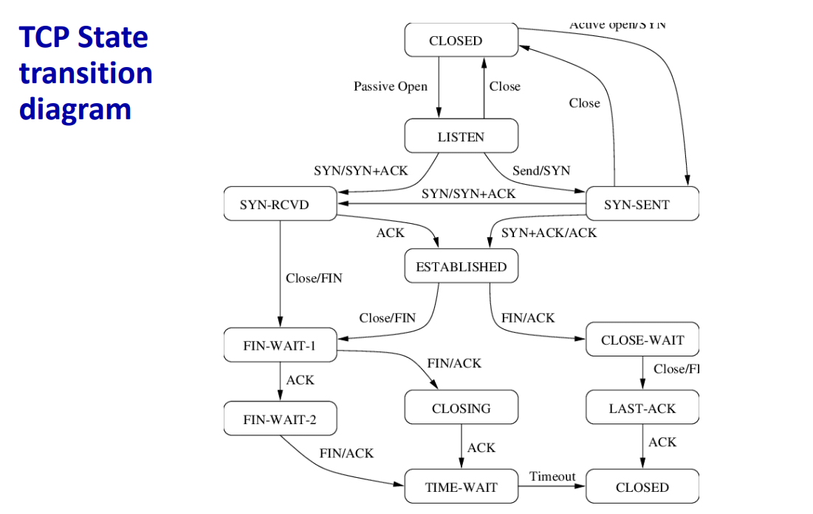
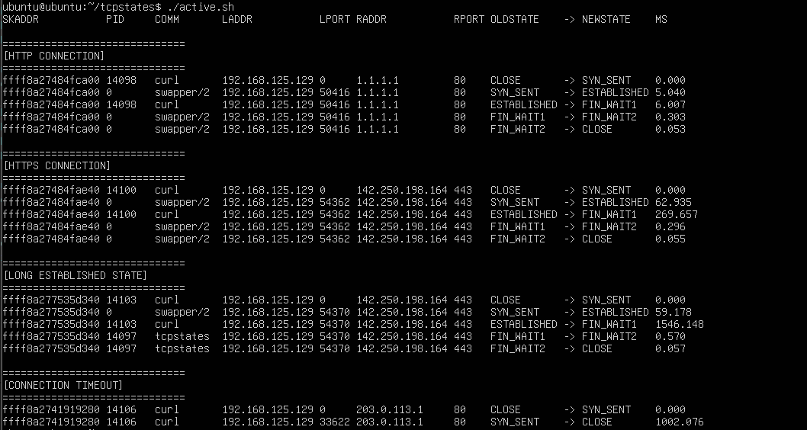

# TCP 연결 상태와 TCP RTT 기록  

### 개요  
전 실습인 [TCP 연결 지연 확인](./03-tcp-connection-latency.md.md)에서 TCP connect를 호출한 시점부터 연결이 완료되는 시점까지 시간을 확인했다. 이번 실습에서는 연결이 성립된 이후에 데이터의 왕복 지연 시간을 기록한다. connent가 끝난 뒤에 내트워크는 혼잡/지연 등 여러 요인으로 RTT가 변하게되는데, 이번 실습을 통해 어느 state에서 얼마나 걸렸는지 확인할 수 있는 방법을 알아본다.  

<br>


### tcpstates  
tcprtt와 tcpstates 도구를 사용하면 네트워크 문제를 더 쉽게 찾을 수 있도록 TCP 연결의 왕복 시간을 모니터링하고 네트워크 품질을 평가하여 문제를 식별하는데 도움을 줄 수 있다.  

<br>


### TCP State transition


  


<br>


### 실습 코드

```c
// SPDX-License-Identifier: (LGPL-2.1 OR BSD-2-Clause)
/* Copyright (c) 2021 Hengqi Chen */
#include <vmlinux.h>
#include <bpf/bpf_helpers.h>
#include <bpf/bpf_tracing.h>
#include <bpf/bpf_core_read.h>
#include "tcpstates.h"

#define MAX_ENTRIES	10240
#define AF_INET		2
#define AF_INET6	10

const volatile bool filter_by_sport = false;
const volatile bool filter_by_dport = false;
const volatile short target_family = 0;

struct {
	__uint(type, BPF_MAP_TYPE_HASH);
	__uint(max_entries, MAX_ENTRIES);
	__type(key, __u16);
	__type(value, __u16);
} sports SEC(".maps");

struct {
	__uint(type, BPF_MAP_TYPE_HASH);
	__uint(max_entries, MAX_ENTRIES);
	__type(key, __u16);
	__type(value, __u16);
} dports SEC(".maps");

struct {
	__uint(type, BPF_MAP_TYPE_HASH);
	__uint(max_entries, MAX_ENTRIES);
	__type(key, struct sock *);
	__type(value, __u64);
} timestamps SEC(".maps");

struct {
	__uint(type, BPF_MAP_TYPE_PERF_EVENT_ARRAY);
	__uint(key_size, sizeof(__u32));
	__uint(value_size, sizeof(__u32));
} events SEC(".maps");

SEC("tracepoint/sock/inet_sock_set_state")
int handle_set_state(struct trace_event_raw_inet_sock_set_state *ctx)
{
	struct sock *sk = (struct sock *)ctx->skaddr;
	__u16 family = ctx->family;
	__u16 sport = ctx->sport;
	__u16 dport = ctx->dport;
	__u64 *tsp, delta_us, ts;
	struct event event = {};

	if (ctx->protocol != IPPROTO_TCP)
		return 0;

	if (target_family && target_family != family)
		return 0;

	if (filter_by_sport && !bpf_map_lookup_elem(&sports, &sport))
		return 0;

	if (filter_by_dport && !bpf_map_lookup_elem(&dports, &dport))
		return 0;

	tsp = bpf_map_lookup_elem(&timestamps, &sk);
	ts = bpf_ktime_get_ns();
	if (!tsp)
		delta_us = 0;
	else
		delta_us = (ts - *tsp) / 1000;

	event.skaddr = (__u64)sk;
	event.ts_us = ts / 1000;
	event.delta_us = delta_us;
	event.pid = bpf_get_current_pid_tgid() >> 32;
	event.oldstate = ctx->oldstate;
	event.newstate = ctx->newstate;
	event.family = family;
	event.sport = sport;
	event.dport = dport;
	bpf_get_current_comm(&event.task, sizeof(event.task));

	if (family == AF_INET) {
		bpf_probe_read_kernel(&event.saddr, sizeof(event.saddr), &sk->__sk_common.skc_rcv_saddr);
		bpf_probe_read_kernel(&event.daddr, sizeof(event.daddr), &sk->__sk_common.skc_daddr);
	} else { /* family == AF_INET6 */
		bpf_probe_read_kernel(&event.saddr, sizeof(event.saddr), &sk->__sk_common.skc_v6_rcv_saddr.in6_u.u6_addr32);
		bpf_probe_read_kernel(&event.daddr, sizeof(event.daddr), &sk->__sk_common.skc_v6_daddr.in6_u.u6_addr32);
	}

	bpf_perf_event_output(ctx, &events, BPF_F_CURRENT_CPU, &event, sizeof(event));

	if (ctx->newstate == TCP_CLOSE)
		bpf_map_delete_elem(&timestamps, &sk);
	else
		bpf_map_update_elem(&timestamps, &sk, &ts, BPF_ANY);

	return 0;
}

char LICENSE[] SEC("license") = "Dual BSD/GPL";
```


<br>

### 코드 해석  

우선 맵 부터 확인을 해보면 네개의 맵을 확인할 수 있다.  
sports 맵과 dports 맵은 각각 소스 포트와 목적지 포트를 키로 저장하고 value는 각 포트 번호가 필터링 대상인지 판별하기 위한 플래그로 사용된다. 
timestamps 맵은 소켓 포인터를 키로 가지며 소켓 단위로 어떠한 시점을 저장하기 위해 사용된다. 이 값들을 통해 각 state에서 걸린 시간을 계산하는데 쓰일 것이다.  
events 맵은 사용자 공간으로 이벤트를 전달하기 위해 사용된다. 타입 또한 BPF_MAP_TYPE_PERF_EVENT_ARRAY이며 ebpf 코드에서 수집한 정보를 유저공간으로 전달하는데 사용될 것이다.  

이제 inet_sock_set_state 지점에 붙여진 함수가 나온다. inet_sock_set_state는 커널이 tcp 소켓의 state를 변경할 때 발생하는 tp이다. 즉 상태가 변경되는 지점에서 정확히 관측이 가능하다는 의미이다.  

event 구조체를 채우는 부분을 보면 skaddr로 소켓의 주소값, ts_us로 이벤트 발생시각, delta_us로 직전 상태전이 이후부터 지난 시간, pid, oldstate/newstate로 tcp의 상태가 어떻게 변했는지, sport/dport로 포트 정보를 저장했다.  

이후로 ipv4와 ipv6에 따라 각각 다르게 주소를 읽어주고 유저공간으로 event를 전송한다.  


<br>


### 코드 컴파일  

오브젝트 파일을 만들어주고,  
```
clang -O2 -g -target bpf -D__TARGET_ARCH_x86 -I. -c tcpstates.bpf.c -o tcpstates.bpf.o
```

스켈레톤 헤더파일도 만들어주고, 
```
bpftool gen skeleton tcpstates.bpf.o > tcpstates.skel.h
```

유저 프로그램을 빌드해준다. 
```
cc -O2 -g tcpstates.c -o tcpstates -I. -lbpf -lelf -lz
```


이제 실행을 해주면된다. 간단하게 sh 코드를 작성해봤다.  
이전 실습에서는 백그라운드에서 실행한 후 kill 해주는 부분이 없어서 이번에 추가해봤다.   
```sh
#!/usr/bin/env bash
set -euo pipefail

sudo ./tcpstates &
TCPSTATES_PID=$!
sleep 3

echo
echo "=============================="
echo "[HTTP CONNECTION]"
echo "=============================="

curl -4 -s http://1.1.1.1 > /dev/null || true
sleep 2

echo
echo "=============================="
echo "[HTTPS CONNECTION]"
echo "=============================="

curl -4 -s https://www.google.com > /dev/null || true
sleep 2

echo
echo "=============================="
echo "[LONG ESTABLISHED STATE]"
echo "=============================="

curl -4 -s --limit-rate 30k https://www.google.com > /dev/null || true
sleep 2

echo
echo "=============================="
echo "[CONNECTION TIMEOUT]"
echo "=============================="

curl -4 -s --connect-timeout 1 http://203.0.113.1 > /dev/null || true
sleep 2


sudo kill $TCPSTATES_PID
wait $TCPSTATES_PID 2>/dev/null || true
```

우선 가장 기분적인 http 연결을 관측해보고, 다음으로 https도 관측해보자.  
그리고 --limit-rate 30k를 사용하여 데이터를 천천히 보내서 지속시간이 어떻게 변하는지도 관측해보고 마지막으로 타임아웃 상황일 때 어떻게 되는지도 알아보자. 타임아웃은 203.0.113.1 대역으로 실제 존재하지 않는 테스트용 주소이다 (TEST-NET-3)


<br>

### 실행 결과  

  

위 결과를 해석하면 아래와 같다.  

- [HTTP CONNECTION]
	- 흐름 : CLOSE - SYN_SENT - ESTABLISHED - FIN_WAIT1 - FIN_WAIT2 - CLOSE
	- 의미 : 매우 빠른 TCP 수명 주기이다. 서버 응답(5ms)과 데이터 전송(6ms) 모두 즉각적으로 이루어졌다. 

- [HTTPS CONNECTION]
	- 흐름 : CLOSE - SYN_SENT - ESTABLISHED - FIN_WAIT1 - FIN_WAIT2 - CLOSE
	- 의미 : TLS	암호화 통신으로 오버헤드가 있음을 보여준다. TCP 연결은 성공했지만, 내부적으로 암호화 키를 교환하느라 ESTABLISHED 상태 유지 시간이 HTTP 대비 약 45배(269ms) 증가한 것을 확인할 수 있다.

- [LONG ESTABLISHED STATE]
	- 흐름 : CLOSE - SYN_SENT - ESTABLISHED - FIN_WAIT1 - FIN_WAIT2 - CLOSE
	- 의미 : 데이터 전송 속도가 느릴수록 소켓 점유 시간이 길다는 것을 알 수 있다. 인위적인 속도 제한(30k)을 통해 ESTABLISHED 상태가 1.5초(1546ms) 넘게 유지되었으며, 이는 네트워크 대역폭이 좁을수록 서버의 연결 자원이 더 오래 소모됨을 뜻한다. 

- [CONNECTION TIMEOUT]
	- 흐름 : CLOSE - SYN_SENT - CLOSE
	- 의미 : 응답이 없는 상황에서의 자원을 회수하는 과정을 보여준다. 서버의 응답이 없으니 curl에 설정된 1초 타임아웃에 맞춰 커널이 SYN_SENT 상태에서 약 1002ms를 대기한 후, 다음 단계로 넘어가지 않고 즉시 자원을 해제(CLOSE)하는 것을 확인할 수 있다. 


<br>
<br>


### References  

- Full practice sequence : https://github.com/eunomia-bpf/bpf-developer-tutorial/blob/main/src/16-memleak/README.md
