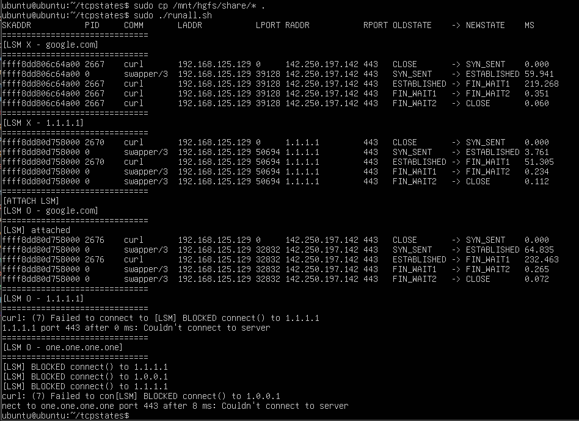

# LSM을 사용한 보안 탐지 & 방어   

### LSM (Linux System Modules)  
LSM은 Linux 2.6 부터 리눅스 커널의 공식 보안 프레임 워크로 사용되어왔다. 리눅스 5.7에서 BPF LSM이 도입되면서 시스템 개발자는 함수 수준의 보안 검사를 자유롭게 구현할 수 있게 됐다. LSM은 커널이 특정 자원에 접근하기 전에 보안 훅을 심어두고 이를 통해 보안 모듈이 커널 동작을 허용할지 판단할 수 있도록 만들었다.  

LSM에서 지원하는 훅 지점의 예시로는 아래와 같다.  
- 파일 열기, 생성, 삭제 및 이동
- 파일 시스템 마운트
- 작업 및 프로세스에 대한 운영
- 소켓 관련 작업(소켓 생성, 바인딩, 메시지 송수신 등)

더 많은 훅 포인트는 아래 링크에서 확인할 수 있다.  
- https://github.com/torvalds/linux/blob/master/include/linux/lsm_hook_defs.h 


### BPF LSM 가용성 확인  
커널이 5.7 이상인지, BPF LSM 지원이 활성화되어 있는지 확인을 해주어야한다.  
```bash
$ uname -r
6.8.0-90-generic

$ cat /boot/config-$(uname -r) | grep BPF_LSM
CONFIG_BPF_LSM=y
```

출력에서 커널의 버전과 LSM 지원을 확인했다면 다음 명령어를 통해 bpf 옵션이 포함되어 있는지 확인할 수 있다.  

```bash
$ cat /sys/kernel/security/lsm
lockdown,capability,landlock,yama,apparmor
```

만약 위와 같이 출력결과에 bpf가 포함되지 않는다면 `/etc/default/grub`을 수정해준다. 이전 결과에 bpf를 추가하여 적어준다.  

```
GRUB_CMDLINE_LINUX="lsm=lockdown,capability,landlock,yama,apparmor,bpf"
```

그리고 grub 설정을 업데이트를 하고 재시작해주면 된다 (업데이트 명령어는 시스템에 따라 다를 수 있음)  

```
$ sudo update-grub
$ sudo reboot
```

<br>

### 실습 코드   


```c
// lsm-connect.bpf.c
#include "vmlinux.h"
#include <bpf/bpf_core_read.h>
#include <bpf/bpf_helpers.h>
#include <bpf/bpf_tracing.h>

char LICENSE[] SEC("license") = "GPL";

#define EPERM 1
#define AF_INET 2

const __u32 blockme = 16843009; // 1.1.1.1 -> int

SEC("lsm/socket_connect")
int BPF_PROG(restrict_connect, struct socket *sock, struct sockaddr *address, int addrlen, int ret)
{
    // Satisfying "cannot override a denial" rule
    if (ret != 0)
    {
        return ret;
    }

    // Only IPv4 in this example
    if (address->sa_family != AF_INET)
    {
        return 0;
    }

    // Cast the address to an IPv4 socket address
    struct sockaddr_in *addr = (struct sockaddr_in *)address;

    // Where do you want to go?
    __u32 dest = addr->sin_addr.s_addr;
    bpf_printk("lsm: found connect to %d", dest);

    if (dest == blockme)
    {
        bpf_printk("lsm: blocking %d", dest);
        return -EPERM;
    }
    return 0;
}
```


```c
// lsm-connect.bpf.c
#include "vmlinux.h"
#include <bpf/bpf_core_read.h>
#include <bpf/bpf_helpers.h>
#include <bpf/bpf_tracing.h>

char LICENSE[] SEC("license") = "GPL";

#define EPERM 1
#define AF_INET 2

const __u32 blockme = 16843009; // 1.1.1.1 -> int

SEC("lsm/socket_connect")
int BPF_PROG(restrict_connect, struct socket *sock, struct sockaddr *address, int addrlen, int ret)
{
    // Satisfying "cannot override a denial" rule
    if (ret != 0)
    {
        return ret;
    }

    // Only IPv4 in this example
    if (address->sa_family != AF_INET)
    {
        return 0;
    }

    // Cast the address to an IPv4 socket address
    struct sockaddr_in *addr = (struct sockaddr_in *)address;

    // Where do you want to go?
    __u32 dest = addr->sin_addr.s_addr;
    bpf_printk("lsm: found connect to %d", dest);

    if (dest == blockme)
    {
        bpf_printk("lsm: blocking %d", dest);
        return -EPERM;
    }
    return 0;
}
```

<br>

# 코드 해석  

이번 코드는 매우 간단하다.  
lsm 이 제공하는 socket_connect 훅에 코드를 붙인 구조이다.  
데이터를 전송할 맵도 별도로 존재하지 않고 훅에 붙인 코드에서 차단되는 코드인지 확인하고 차단 대상이라면 연결을 거부하는 방식이다.  

ret을 먼저 검사하는 이유는 다른 LSM이 거부한 요청을 다시 허용하지 않기 위해서이다. 거부했다면 그대로 반환한다. 그리고 ipv4만 처리하도록 하고 ipv6 등 다른 주소 패밀리에 속한다면 검사하지 않고 그대로 허용한다.  

목적지 ip는 dest로 저장하고 이 값을 이전에 설정한 차단ip인 blockme와 비교한다. 추가하고 싶은 ip가 있다면 여기를 수정하면 될 것 같다.  

요약하자만 connect 호출 시점에 시작되는 프로그램이고 차단 대상 IP인지 검사하고 SYN 패킷이 전송되기 전에 시스템콜 단계에서 연결을 거부한다.  


<br>

### 코드 실행 & 컴파일   

코드를 컴파일 하기 위해서 유저 코드가 있어야하는데 따로 코드가 없어서 간단하게 만들어봤다.  

**lsm-connect.c**
```c
#include <stdio.h>
#include <unistd.h>
#include <string.h>
#include <stdlib.h>
#include <arpa/inet.h>
#include <bpf/libbpf.h>
#include "lsm-connect.skel.h"

static void print_block_log(const char *line)
{
    const char *key = "lsm: blocking ";
    const char *p = strstr(line, key);
    if (!p)
        return;

    unsigned long v = strtoul(p + strlen(key), NULL, 10);

    struct in_addr addr = {
        .s_addr = (uint32_t)v
    };

    char ip[INET_ADDRSTRLEN];
    if (!inet_ntop(AF_INET, &addr, ip, sizeof(ip)))
        snprintf(ip, sizeof(ip), "unknown");

    printf("[LSM] BLOCKED connect() to %s\n", ip);
}

int main(void)
{
    struct lsm_connect_bpf *skel;
    FILE *tp;
    char line[4096];

    skel = lsm_connect_bpf__open();
    if (!skel)
        return 1;

    if (lsm_connect_bpf__load(skel))
        return 1;

    if (lsm_connect_bpf__attach(skel))
        return 1;

    printf("[LSM] attached\n");

    tp = fopen("/sys/kernel/debug/tracing/trace_pipe", "r");
    if (!tp)
        return 1;

    while (fgets(line, sizeof(line), tp)) {
        if (strstr(line, "lsm: blocking"))
            print_block_log(line);
    }

    lsm_connect_bpf__destroy(skel);
    return 0;
}
```


그리고 실행시킬 sh 코드도 같이 만들었다.   
추가로 이전 시간에 사용했던 `tcpstates`를 활용해서 보낸 패킷을 보다 자세하게 확인할 수 있도록 만들었다.  

```sh
#!/usr/bin/env bash
set -euo pipefail


sudo ./tcpstates &
TCPSTATES_PID=$!
sleep 1


echo "=============================="
echo "[LSM X - google.com]"
echo "=============================="

curl -4 -sS -o /dev/null --connect-timeout 2 https://google.com || true
sleep 1


echo "=============================="
echo "[LSM X - 1.1.1.1]"
echo "=============================="

curl -4 -sS -o /dev/null --connect-timeout 2 https://1.1.1.1 || true
sleep 1


echo "=============================="
echo "[ATTACH LSM]"
echo "[LSM O - google.com]"
echo "=============================="


sudo ./lsm-connect &
LSM_PID=$!
sleep 1


curl -4 -sS -o /dev/null --connect-timeout 2 https://google.com || true
sleep 1


echo "=============================="
echo "[LSM O - 1.1.1.1]"
echo "=============================="

curl -4 -sS -o /dev/null --connect-timeout 2 https://1.1.1.1 || true
sleep 1


echo "=============================="
echo "[LSM O - one.one.one.one]"
echo "=============================="

curl -4 -sS -o /dev/null --connect-timeout 2 https://one.one.one.one/ || true
sleep 1


sudo kill $LSM_PID
wait $LSM_PID 2>/dev/null || true

sudo kill $TCPSTATES_PID
wait $TCPSTATES_PID 2>/dev/null || true
```

1.1.1.1 주소에 대해서는 도메인 주소로도 실험을 해보기 위해서 ebpf에 코드도 일부 수정해줬다.   
1.1.1.1은 one.one.one.one 주소를 가지는데 이 주소는 A 레코드가 2개이므로 두 주소에 대해 차단해줬다.   

```bash
$ dig one.one.one.one
;; ANSWER SECTION:
one.one.one.one.        65003   IN      A       1.1.1.1
one.one.one.one.        65003   IN      A       1.0.0.1
```

```c
// 생략 
const __u32 block1 = 16843009; // 1.1.1.1 
const __u32 block2 = 16777217; // 1.0.0.1 추가 

SEC("lsm/socket_connect")
int BPF_PROG(restrict_connect, struct socket *sock, struct sockaddr *address, int addrlen, int ret)
{
    // 생략

    if (dest == block1 || dest == block2)
    {
        bpf_printk("lsm: blocking %d", dest);
        return -EPERM;
    }
    return 0;
}
```

오브젝트 파일을 만들어주고,  
```
clang -O2 -g -target bpf -D__TARGET_ARCH_x86 -I. -c lsm-connect.bpf.c -o lsm-connect.bpf.o
```

스켈레톤 헤더파일도 만들어주고,  
```
bpftool gen skeleton lsm-connect.bpf.o > lsm-connect.skel.h
```

유저 프로그램을 빌드해준다. 
```
cc -O2 -g lsm-connect.c -o lsm-connect -I. -lbpf
```

그리고 실행시켜줬다.  
```
sudo ./runall.sh
```

<br>

### 실행 결과  

   

실행결과를 정리하면 아래와 같다.  

- [LSM X - google.com]
    - 상황 : LSM이 적용되지 않은 상태에서 google.com으로 연결을 시도.
	- 결과 : TCP 동작이 잘 보인다.


- [LSM X - 1.1.1.1]
	- 상황 : LSM이 적용되지 않은 상태에서 1.1.1.1로 연결을 시도하였다.
	- 결과 : google.com과 동일하게 정상적으로 TCP 연결이 됐다. 


- [ATTACH LSM]
- [LSM O - google.com]
	- 상황 : LSM이 적용된 상태에서 google.com으로 연결을 시도하였다.
	- 결과 : 차단 대상이 아닌 연결에 대해서는 동일하게 잘 연결이 된다. 

- [LSM O - 1.1.1.1]
	- 상황 : LSM이 적용된 상태에서 차단 대상 IP인 1.1.1.1로 연결을 시도하였다.
	- 결과 : `connect()` 단계에서 즉시 연결이 거부되었다.
        - tcpstates 상에서는 `SYN_SENT` 상태가 거의 또는 전혀 관찰되지 않았다.
        - 즉, LSM `socket_connect` 훅은 TCP 3-way handshake 이전에 실행되는 것으로 이해할 수 있다. 
        - SYN 패킷 자체가 네트워크로 전송되지 않는다. TCP 스택에 진입하기 전에 시스템 콜 단계에서 연결이 차단된다는 것이다. 

- [LSM O - one.one.one.one]
	- 상황 : one.one.one.one 도메인으로 연결을 시도하였다.
	- 결과 : DNS 결과로 여러 IPv4 주소가 반환되었고, 각 IP에 대해 순차적으로 `connect()`가 시도되었다.
        - 차단 목록에 포함된 모든 IP에 대해 LSM 차단이 발생하였다.
        - IP 기반 차단은 특정 도메인에 대해 모든 IP를 차단하지 않으면 우회가 가능하다.


<br>
<br>


### References    

- Full practice sequence : https://github.com/eunomia-bpf/bpf-developer-tutorial/blob/main/src/16-memleak/README.md

- More hook points : https://github.com/torvalds/linux/blob/master/include/linux/lsm_hook_defs.h