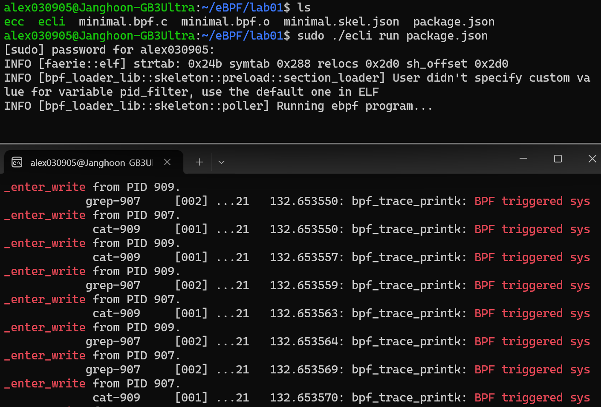

# Tracepoint 기반 syscall 후킹

/*
ecc ecli 설명 파일 여기 병합
*/

### ecc, ecli 설치
```bash
$ wget https://aka.pw/bpf-ecli -O ecli && chmod +x ./ecli
$ ./ecli -h
Usage: ecli [--help] [--version] [--json] [--no-cache] url-and-args
```

```bash
$ wget https://github.com/eunomia-bpf/eunomia-bpf/releases/latest/download/ecc && chmod +x ./ecc
$ ./ecc -h
eunomia-bpf compiler
Usage: ecc [OPTIONS] <SOURCE_PATH> [EXPORT_EVENT_HEADER]
....
```

ecc와 ecli 를 다운 받고 간단한 예제부터 시작해보자.  
<br>

### minimal.bpf.c 실습 파일
```c
/* SPDX-License-Identifier: (LGPL-2.1 OR BSD-2-Clause) */
#define BPF_NO_GLOBAL_DATA
#include <linux/bpf.h>
#include <bpf/bpf_helpers.h>
#include <bpf/bpf_tracing.h>

typedef unsigned int u32;
typedef int pid_t;
const pid_t pid_filter = 0;

char LICENSE[] SEC("license") = "Dual BSD/GPL";

SEC("tp/syscalls/sys_enter_write")
int handle_tp(void *ctx)
{
 pid_t pid = bpf_get_current_pid_tgid() >> 32;
 if (pid_filter && pid != pid_filter)
  return 0;
 bpf_printk("BPF triggered sys_enter_write from PID %d.\n", pid);
 return 0;
}
```
위 코드를 `minimal.bpf.c` 이름으로 저장해두고 실행해보자.  
어떤 코드인지는 실행 후 결과를 보고 분석해보기로 하고, 실행하기 위해 우선 clang과 llvm 먼저 다운로드 받자. 각 역할은 아래에 정리해뒀다.    
<br>

### clang, llvm 설치  
```bash
sudo apt install clang llvm
```
- clang: C 코드를 LLVM IR 로 변환하는 역할
- llvm: LLVM IR 을 eBPF 바이트코드 로 최종 변환하는 역할

<br>

### 실습 파일 컴파일
```bash
$ ./ecc minimal.bpf.c
Compiling bpf object...
Packing ebpf object and config into package.json...
```

ecc로 컴파일을 해준다.   
<br>

그리고 폴더에 존재하는 파일들을 보면 아래 처럼 나오고 각 역할은 다음과 같다.  
- `minimal.bpf.c` : eBPF 프로그램을 C 언어로 작성된 원본 c 코드  

- `minimal.bpf.o` : ecc로 컴파일한 eBPF 오브젝트 파일이다.  
  - 커널이 직접 이해할 수 있는 eBPF 바이트코드와, 맵 정의 등의 메타정보가 포함되어 있다.
- `minimal.skel.json` : ecc가 `.o` 파일을 기반으로 생성하는 스켈레톤 JSON 파일이다. 
    - 이 JSON 파일 덕분에 실행 환경(ecli) 은 `.o` 파일을 직접 파싱하지 않고, JSON을 읽어서 손쉽게 프로그램을 attach 할 수 있다.

- `package.json` : 해당 프로젝트의 빌드, 실행 환경 설정 파일  

이렇게 총 네개의 파일이 존재하게 되는데 이중에서 프로젝트 빌드에 해당하는 `package.json` 파일을 실행시켜주면 된다.   
<br>

### 프로젝트 실행




```bash
$ sudo ./ecli run package.json
Running eBPF program...
```


<br>

```bash
$ sudo cat /sys/kernel/debug/tracing/trace_pipe | grep "BPF triggered sys_enter_write"
```

그리고 `BPF triggered sys_enter_write` 를  grep 해주면,   
이런식으로 `BPF triggered sys_enter_write` 문구가 계속 뜬다.    

왜 이런 결과가 나오는지 확인해보자.  
<br>

### minimal.bpf.c 분석
```bash
/* SPDX-License-Identifier: (LGPL-2.1 OR BSD-2-Clause) */
#define BPF_NO_GLOBAL_DATA
#include <linux/bpf.h>
#include <bpf/bpf_helpers.h>
#include <bpf/bpf_tracing.h>

typedef unsigned int u32;
typedef int pid_t;
const pid_t pid_filter = 0;

char LICENSE[] SEC("license") = "Dual BSD/GPL";

SEC("tp/syscalls/sys_enter_write")
int handle_tp(void *ctx)
{
 pid_t pid = bpf_get_current_pid_tgid() >> 32;
 if (pid_filter && pid != pid_filter)
  return 0;
 bpf_printk("BPF triggered sys_enter_write from PID %d.\n", pid);
 return 0;
}
```
<br>

**SEC**  
`SEC("경로")` 이 경로 위치에 tracepoint 를 만든다고 이해하면 된다.  

`/usr/include/bpf/bpf_helpers.h`에서 자세하게 살펴볼 수 있는데, 기본 패키지에 있는 파일은 아니라 `libbpg-dev` 설치 후 해당 경로를 살펴보면 있다.    

```bash
sudo apt install libbpf-dev
```
<br>

```c
#if __GNUC__ && !__clang__

/*
 * Pragma macros are broken on GCC
 * https://gcc.gnu.org/bugzilla/show_bug.cgi?id=55578
 * https://gcc.gnu.org/bugzilla/show_bug.cgi?id=90400
 */
#define SEC(name) __attribute__((section(name), used))

#else

#define SEC(name) \
        _Pragma("GCC diagnostic push")                                  \
        _Pragma("GCC diagnostic ignored \"-Wignored-attributes\"")      \
        __attribute__((section(name), used))                            \
        _Pragma("GCC diagnostic pop")                                   \

#endif
```
여기서 `__attribute__((section(name), used))` 를 보면 C 언어에서 `__attribute__` 역할처럼 속성을 붙여준다. 여기서는 `section`으로 `tp/syscalls/sys_enter_write` 섹션에 `handle_tp` 함수를 넣는다.  

`handle_tp` 함수는 `write()` 시스템 콜이 실행되기 직전에 커널에서 호출되는 eBPF 프로그램이다. `bpf_get_current_pid_tgid()` 를 통해 현재 PID를 얻어오고, `bpf_printk`를 이용해 PID 정보를 커널 trace 로그(`trace_pipe`)에 출력한다.  

이 함수가 `tp/syscalls/sys_enter_write` 섹션에 들어간다는 의미는, libbpf가 이를 tracepoint syscalls:sys_enter_write 이벤트와 자동으로 연결한다는 뜻이다.  
간단히 말해서 `write()` 시스템 콜이 실행될 때마다 커널이 이 eBPF 함수를 불러올 수 있도록 후킹해둔 것이다.

> `tracepoint:syscalls:sys_enter_`는 리눅스 커널의 시스템 콜(syscall)이 프로그램에 의해 호출되는 시점(enter)을 추적(trace)하기 위해 미리 정의된 "트레이스포인트"를 의미한다.  

> "syscalls"는 시스템 콜 관련 이벤트 그룹을, "sys_enter_"는 특정 시스템 콜이 실행되기 직전에 발생하는 이벤트를 나타내며, 뒤에 오는 단어는 해당 시스템 콜의 이름(ex: accept, write)을 가리킨다.  

<br>

### 요약
이번 실습에서 `ecc`와 `ecli`를 설치해보고 간단한 eBPF 프로그램을 가져와서 tracepoint 에 붙이는 과정을 따라가보았다.  
syscall 후킹을 위해 커널이 공식적으로 제공하는 tracepoint 를 활용해보고, `write()` 시스템 콜 진입 지점(`sys_enter_write`)에 프로그램을 attach 하여 커널 동작을 관찰할 수 있었다.  

이를 통해 기존 커널 코드나 시스템 콜 테이블을 직접 수정하지 않고도, eBPF를 이용해 안전하고 표준적인 방식으로 커널 이벤트를 후킹할 수 있음을 배웠다.  
이러한 접근을 통해 모니터링, 보안 등 다양한 목적으로 활용할 수 있어 보인다.  


<br>
<br>

## References
- Full practice sequence : https://github.com/eunomia-bpf/bpf-developer-tutorial/blob/main/src/1-helloworld/README.md
- Compile and Run & minimal.bpf.c : https://github.com/eunomia-bpf/eunomia-bpf/tree/master/examples/bpftools/minimal