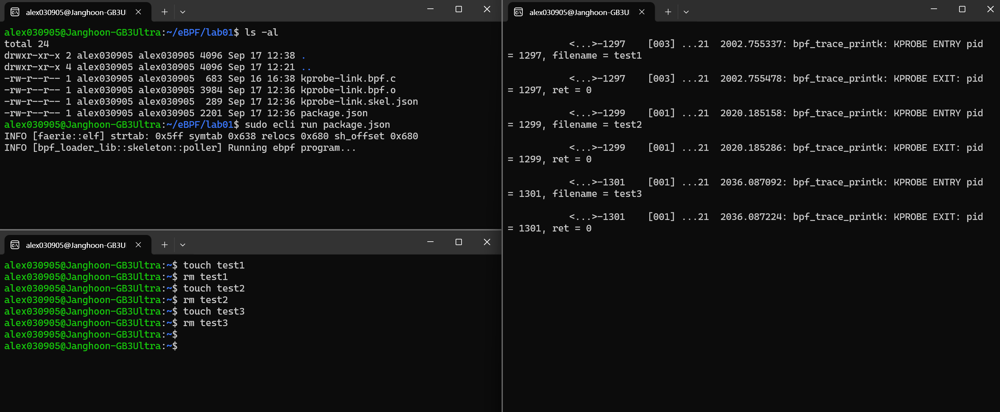

# kprobe 기반 syscall 후킹

### Tracepoint VS kprobe

이전 02-Tracepoint-Based-Syscall-Hooking 에서 tracepoint 기반의 syscall 후킹을 살펴봤다.  

`sys_enter_write` 같은 tracepoint를 활용하여 `write()` 시스템 콜이 호출될 때마다 호출된 시점, 호출한 PID 를 확인해 봤다. 이 방식은 커널이 공식적으로 제공하는 안정된 지점이기 때문에 커널 업데이트나 구조 변경이 있어도 깨지지 않고 비교적 안전하게 사용할 수 있다는 장점이 있다.  

그런데 위에 언급했듯이 공식적으로 제공하는 지점이기 때문에, tracepoint 는 미리 정의된 지점에서만 활용이 가능하다는 한계가 있다. 모든 함수에 tracepoint가 존재하는 것은 아니므로, 사용자가 특정 함수나 코드 경로를 더욱 자유롭게 추적하고 싶을 때는 **kprobe**를 활용한다.  

kprobe는 커널 내부의 임의 함수나 특정 명령어 실행 지점에 따로 훅을 걸 수 있으므로 tracepoint 보다 훨씬 넓은 범위에서 활용이 가능하다.  

물론 그렇다고 해서 kprobe가 항상 더 좋은 것은 아니다. 어디든 심을 수 있는 강력한 도구인 만큼 tracepoint 에 비해 오버헤드가 많고 대규모 모니터링이나 장기간 성능 분석에 약하다. 또한 kpobe 실행 시점에 동적으로 명령어를 가로채기 때문에 상대적으로 부담이 크고, 잘못 사용하묜 시스템 크래시까지 이어질 수 있다.  

요약하자면 tracepoint는 안정적이지만 괸찰 지점이 제한적인 도구이고, kprobe는 강력하고 유연하지만  오사용 시 위험 부담이 있는 도구이다.   
<br>

### kprobe 제한사항  
위험할 여지가 있는 도구인 만큼 google git 페이지에서 kprobe 제한사항을 찾아볼 수 있다. 아래에 언급된 내용을 간단히 정리해놨다.  

- post_handler가 있는 프로브는 점프 최적화를 적용할 수 없다.

- 점프 최적화는 여러 안전성 검사를 통과해야 하며 조건을 만족하지 못하면 적용되지 않는다.

- 점프 최적화는 CONFIG_PREEMPT=n 환경에서만 지원된다.

- 점프 최적화가 켜져 있으면 pre_handler에서 regs->ip를 바꿔도 무시된다.

- kprobe 자체 코드나 핵심 경로(do_page_fault, notifier_call_chain 등)에는 프로브를 걸 수 없다.

- NOKPROBE_SYMBOL로 표시된 심볼에는 프로브를 걸 수 없다.

- 인라인되는 함수는 모든 인스턴스를 추적하지 못한다.

- 핸들러는 프리엠션 비활성 또는 인터럽트 비활성 상태에서 실행되므로 블로킹 동작이나 무거운 작업을 하면 안 된다.

- 같은 경로에 프로브를 걸고 핸들러에서 다시 해당 경로를 호출하면 충돌이 생기고 nmissed 카운터가 증가한다.

- 아키텍처별 제약이 존재하며 ia64는 slot1 명령어 위치에 프로브를 걸 수 없고 sparc64는 kretprobe를 지원하지 않는다.

- 다중 CPU 환경에서 여러 핸들러가 동시에 실행될 수 있으므로 재진입성과 경쟁 상태를 고려해야 한다.

- kprobe는 실행 맥락을 수정할 수 있으므로 의도치 않게 시스템 불안정을 일으킬 수 있다. 

<br>

> 더 자세한 설명은 하단 References 의 Kprobes Features and Limitations 를 참고 (해당 링크의 5번 목차 Kprobes Features and Limitations)

<br>

### kprobe-link.bpf.c 실습 파일
```c
#include "vmlinux.h"
#include <bpf/bpf_helpers.h>
#include <bpf/bpf_tracing.h>
#include <bpf/bpf_core_read.h>

char LICENSE[] SEC("license") = "Dual BSD/GPL";

SEC("kprobe/do_unlinkat")
int BPF_KPROBE(do_unlinkat, int dfd, struct filename *name)
{
    pid_t pid;
    const char *filename;

    pid = bpf_get_current_pid_tgid() >> 32;
    filename = BPF_CORE_READ(name, name);
    bpf_printk("KPROBE ENTRY pid = %d, filename = %s\n", pid, filename);
    return 0;
}

SEC("kretprobe/do_unlinkat")
int BPF_KRETPROBE(do_unlinkat_exit, long ret)
{
    pid_t pid;

    pid = bpf_get_current_pid_tgid() >> 32;
    bpf_printk("KPROBE EXIT: pid = %d, ret = %ld\n", pid, ret);
    return 0;
}
```


### 코드 분석
`unlink`은 폴더에서 파일 이름을 삭제할 때 사용되는 시스템 콜이다.  

그리고 `do_unlinkat` 이벤트를 사용해서 함수의 진입점과 종료점에 훅을 배치해서 시스템 콜을 추적하는 구조이다.  

만약 이전 [02장 SEC 파트](https://github.com/jhwkpdnpwanf/eBPF-study/blob/main/week1/02-Tracepoint-Based-Syscall-Hooking.md#sec)를 안 봤다면 반드시 이해하고 와야한다.  


먼저 `SEC("kprobe/do_unlinkat")` 에 보이듯 kprobe는 함수 진입시에 트리거가 되는 kprobe 라는 식별자이다. 이를 통해 아래의 `BPF_KPROBE` 함수를 `do_unlinkat` 진입시에 실행할 수 있도록 attach 해준 것을 확인할 수 있다.  

`SEC("kretprobe/do_unlinkat")`도 비슷하게 kretprobe을 사용했는데, 이건 함수 종료시에 트리거되는 식별자이다. 이를 통해 `BRETPF_KPROBE` 함수를 `do_unlinkat` 종료 시점에 실행되게 해준다.  

두 함수는 공통적으로 PID를 출력하고, `BPF_KPROBE`는 filename을, `BRETPF_KPROBE`은 `ret`의 반환값을 출력한다.  


<br>

### 컴파일 & 실행  
이전 02장에서 설치해두었던 ecc와 ecli은 편의상 실습 폴더에 놔두었지만, 앞으로 전역에서 계속 사용하기 위해 `/usr/local/bin/` 경로로 옮겨줬다.  

```bash
sudo mv ecc /usr/local/bin/
sudo mv ecli /usr/local/bin/
```
<br>

같은 방법으로 ecc 로 컴파일을 해준 뒤,  
```bash
ecc kprobe-link.bpf.c
```
<br>

ecli로 실행을 해주면 실행이 된다.  
```bash
sudo ecli run package.json
```
<br>

그리고 새로운 화면을 두개 켜준 뒤, 한 화면에서는 파일을 생성, 삭제해주고 다른 화면에서는 `sudo cat /sys/kernel/debug/tracing/trace_pipe` 를 실행하주면 된다.  

**화면 1**
```bash
sudo ecli run package.json
```
<br>

**화면 2**
```bash
touch test1
rm test1
touch test2
rm test2
```
<br>

**화면 3**
```bash
sudo cat /sys/kernel/debug/tracing/trace_pipe
```
<br>

**실행 결과**

  

이렇게 결과가 나오는 것을 확인할 수 있다.  

<br>


### 요약
kprobe와 kretprobe를 사용해서 unlink 시스템 콜을 후킹하는 과정을 학습했다.  

이전에 배운 tracepoint와는 다르게, 진입 함수와 지점을 설정할 수 있기 때문에 더욱 강력한 도구이다. 그만큼 더 다양한 목적으로 사용될 수 있지만 오사용시 위험부담이 있으니 코드를 작성해야한다면 제한 사항을 숙지해두자.  


<br>
<br>

## References
- unlink syscall : https://man7.org/linux/man-pages/man2/unlink.2.html
- Kprobes Features and Limitations : https://android.googlesource.com/kernel/common/+/056ad39ee925/Documentation/kprobes.txt
-  practice sequence : https://github.com/eunomia-bpf/bpf-developer-tutorial/blob/main/src/2-kprobe-unlink/README.md
-  Compile and Run & kprobe-link.bpf.c : https://github.com/eunomia-bpf/eunomia-bpf/tree/master/examples/bpftools/kprobe-link